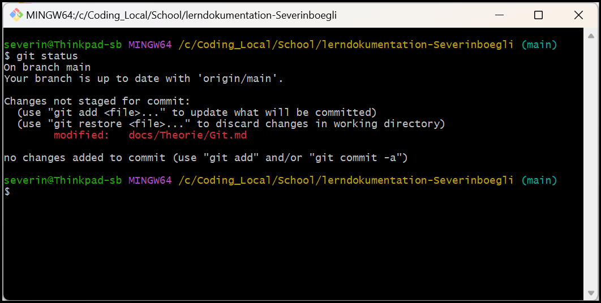
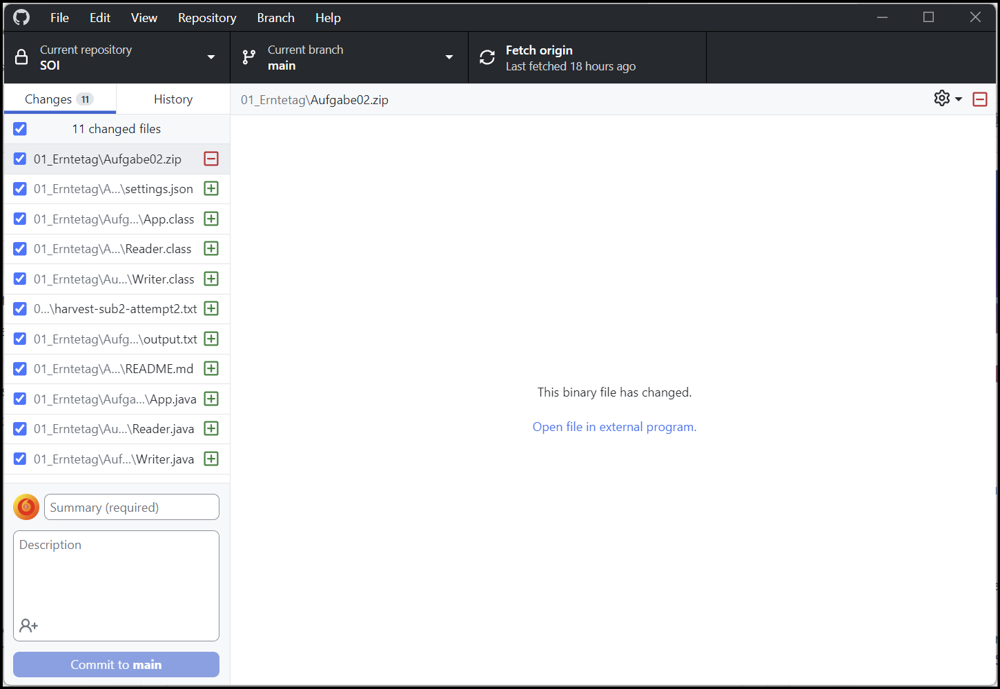

# Inhalte zum Tag 1

## Tätigkeiten
Ich habe GIT kennengelernt und das Git-Repo für das aktuele Projekt geklont.
Mit Hilfe von Docker konnte ich Docsify ausführen. Mein Projekt werde ich nicht auf einer VM dokumentieren, da ich auf einer VM längere Wartezeiten habe.

## Theorie
Heute habe ich zu folgenden Themen eine Theorie aufgeschrieben:
- [Git](Theorie/Git.md)

## Github
Github werde ich nutzen, um das Repo zu pushen und als Datenablage. Mit Hilfe von Github Desktop kann das Gitprozess auch über eine grafische Oberfläche verwaltet werden. Um zu überprüfen, ob das Repo aktuell ist, sollte man auf [Github.com](https://github.com/) das relevante Repo öffnen und die Änderungen überprüfen.

