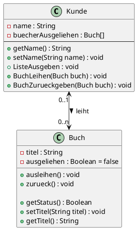

# Inhalte zum Tag 10

## Tätigkeiten
Wir haben heute die Hausaufgaben von der letzten Lektion besprochen. Es ging um Assoziationen zur Aufgabe MuKi.

## Theorie
Ich habe den Eintrag zu Assoziationen, respektive Beziehungen erweitert.

- [Assoziationen](Theorie/Assoziationen.md)

## Praxisaufgabe
Als Praxisaufgabe habe ich die Bücherei Aufgabe gemacht.


### Auftrag 1.3

**Auftrag 1:**

Ich habe die Klasse Buch erstellt

```java
package com.severinboegli;

public class Buch {
    private String titel;
    private boolean ausgeliehen = false;

    public void ausleihen() {
        ausgeliehen = true;
    }

    public void zurueck() {
        ausgeliehen = false;
    }

    public boolean getStatus() {
        return ausgeliehen;
    }

    public void setTitel(String titel) {
        this.titel = titel;
    }

    public String getTitel() {
        return titel;
    }
}

```

Ich kontrolliere mit dem Status, ob ein Buch ausgeliehen worden ist.
ausgeliehen und zurueck sind Methoden, die den Status ändern.

**Auftrag 2:**



**Auftrag 3:**

```java
package com.severinboegli;

public class Kunde {
    private String name;
    private Buch[] buecherAusgeliehen = new Buch[10];

    public void setName(String name) {
        this.name = name;
    }

    public String getName() {
        return name;
    }

    public void BuchLeihen(Buch buch) {
        if (buch.getStatus() == false) {
            for (int i = 0; i < buecherAusgeliehen.length; i++) {
                if (buecherAusgeliehen[i] == null) {
                    buecherAusgeliehen[i] = buch;
                    buch.ausleihen();
                    break;
                }
            }

            System.out.println("Das Maximum an Bücher für diesen Kunden ist erreicht.");
        } else {
            System.out.println("Das Buch ist bereits ausgeliehen.");
        }

    }

    public void ListeAusgeben() {
        System.out.println(name + " hat folgende Bücher ausgeliehen:");
        for (int i = 0; i < buecherAusgeliehen.length; i++) {
            if (buecherAusgeliehen[i] != null)
                System.out.println("- " + buecherAusgeliehen[i].getTitel());
        }
        System.out.println("---------------------");
    }

    public void BuchZurueckgeben(Buch buch) {
        for (int i = 0; i < buecherAusgeliehen.length; i++) {
            if (buecherAusgeliehen[i] == buch) {
                buecherAusgeliehen[i] = null;
                buch.zurueck();
                break;
            }

            System.out.println("Das Buch konnte nicht beim Kunde gefunden werden.");
        }
    }
}


```
