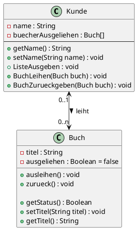

# Inhalte zum Tag 10

## Tätigkeiten
Wir haben heute die Hausaufgaben von der letzten Lektion besprochen. Es ging um Assoziationen zur Aufgabe MuKi. Ausserdem habe ich die Aufgabe zur Bücherei gemacht.

## Theorie
Ich habe den Eintrag zu Assoziationen, respektive Beziehungen erweitert. Die 

- [Beziehungen](Theorie/Beziehungen.md)
- [Aggregation](Theorie/Beziehungen.md)

## Praxisaufgabe
Als Praxisaufgabe habe ich die Bücherei Aufgabe gemacht.


### Auftrag 1.3

**Auftrag 1:**

Ich habe die Klasse Buch erstellt

```java
package com.severinboegli;

public class Buch {
    private String titel;
    private boolean ausgeliehen = false;

    public void ausleihen() {
        ausgeliehen = true;
    }

    public void zurueck() {
        ausgeliehen = false;
    }

    public boolean getStatus() {
        return ausgeliehen;
    }

    public void setTitel(String titel) {
        this.titel = titel;
    }

    public String getTitel() {
        return titel;
    }
}

```

Ich kontrolliere mit dem Status, ob ein Buch ausgeliehen worden ist.
ausgeliehen und zurueck sind Methoden, die den Status ändern.

**Auftrag 2:**



**Auftrag 3:**

```java
package com.severinboegli;

public class Kunde {
    private String name;
    private Buch[] buecherAusgeliehen = new Buch[10];

    public void setName(String name) {
        this.name = name;
    }

    public String getName() {
        return name;
    }

    public void BuchLeihen(Buch buch) {
        if (buch.getStatus() == false) {
            for (int i = 0; i < buecherAusgeliehen.length; i++) {
                if (buecherAusgeliehen[i] == null) {
                    buecherAusgeliehen[i] = buch;
                    buch.ausleihen();
                    break;
                }
            }

            System.out.println("Das Maximum an Bücher für diesen Kunden ist erreicht.");
        } else {
            System.out.println("Das Buch ist bereits ausgeliehen.");
        }

    }

    public void ListeAusgeben() {
        System.out.println(name + " hat folgende Bücher ausgeliehen:");
        for (int i = 0; i < buecherAusgeliehen.length; i++) {
            if (buecherAusgeliehen[i] != null)
                System.out.println("- " + buecherAusgeliehen[i].getTitel());
        }
        System.out.println("---------------------");
    }

    public void BuchZurueckgeben(Buch buch) {
        for (int i = 0; i < buecherAusgeliehen.length; i++) {
            if (buecherAusgeliehen[i] == buch) {
                buecherAusgeliehen[i] = null;
                buch.zurueck();
                break;
            }

            System.out.println("Das Buch konnte nicht beim Kunde gefunden werden.");
        }
    }
}


```


**Auftrag 4:**

```java
package com.severinboegli;

public class Main {
    public static void main(String[] args) {
        
        Kunde[] kunden = new Kunde[5];
        for (int i = 0; i < kunden.length; i++) {
            kunden[i] = new Kunde();
        }

        // Namen der Kunden setzen
        kunden[0].setName("Hans");
        kunden[1].setName("Peter");
        kunden[2].setName("Urs");
        kunden[3].setName("Nina");
        kunden[4].setName("Helene");

        Buch[] buecher = new Buch[16];
        for (int i = 0; i < buecher.length; i++) {
            buecher[i] = new Buch();
        }

        // Titel der Bücher setzen
        buecher[0].setTitel("Der Herr der Ringe");
        buecher[1].setTitel("Der kleine Prinz");
        buecher[2].setTitel("Harry Potter");
        buecher[3].setTitel("Der Alchimist");
        buecher[4].setTitel("Der Name der Rose");
        buecher[5].setTitel("Der Medicus");
        buecher[6].setTitel("Der Vorleser");
        buecher[7].setTitel("Der Schatten des Windes");
        buecher[8].setTitel("Der Schwarm");
        buecher[9].setTitel("Der Pate");
        buecher[10].setTitel("Der Fänger im Roggen");
        buecher[11].setTitel("Der Graf von Monte Christo");
        buecher[12].setTitel("Der Hobbit");
        buecher[13].setTitel("Der Zauberberg");
        buecher[14].setTitel("Der Steppenwolf");
        buecher[15].setTitel("Der Prozess");     


        // Ausleihen
        kunden[0].BuchLeihen(buecher[0]);
        kunden[0].BuchLeihen(buecher[1]);
        kunden[0].BuchLeihen(buecher[2]);
        kunden[0].BuchLeihen(buecher[3]);

        kunden[1].BuchLeihen(buecher[0]);
        kunden[1].BuchLeihen(buecher[4]);

        // Ausgeliehen Bücher anzeigen
        System.out.println("Ausgeliehene Bücher:");
        for (Kunde kunde : kunden) {
            kunde.ListeAusgeben();
        }


    }
}
```

Hier wurden Bücher instanziert. Die Bücher wurden dann den Kunden zugewiesen. Die Kunden haben dann die Bücher ausgeliehen.

> Die Arrays sind vom Typ Buch und Kunde. Es wurde ein Array für alle Bücher und ein Array für alle Kunden erstellt.


**Auftrag 5:**

```java

package com.severinboegli;

import java.util.ArrayList;

public class Main {
    public static void main(String[] args) {

        ArrayList<Kunde> kunden = new ArrayList<>();
        for (int i = 0; i < 5; i++) {
            kunden.add(new Kunde());
        }

        // Namen der Kunden setzen
        kunden.get(0).setName("Hans");
        kunden.get(1).setName("Peter");
        kunden.get(2).setName("Urs");
        kunden.get(3).setName("Nina");
        kunden.get(4).setName("Helene");

        ArrayList<Buch> buecher = new ArrayList<>();
        for (int i = 0; i < 16; i++) {
            buecher.add(new Buch());
        }

        // Titel der Bücher setzen
        buecher.get(0).setTitel("Der Herr der Ringe");
        buecher.get(1).setTitel("Der kleine Prinz");
        buecher.get(2).setTitel("Harry Potter");
        buecher.get(3).setTitel("Der Alchimist");
        buecher.get(4).setTitel("Der Name der Rose");
        buecher.get(5).setTitel("Der Medicus");
        buecher.get(6).setTitel("Der Vorleser");
        buecher.get(7).setTitel("Der Schatten des Windes");
        buecher.get(8).setTitel("Der Schwarm");
        buecher.get(9).setTitel("Der Pate");
        buecher.get(10).setTitel("Der Fänger im Roggen");
        buecher.get(11).setTitel("Der Graf von Monte Christo");
        buecher.get(12).setTitel("Der Hobbit");
        buecher.get(13).setTitel("Der Zauberberg");
        buecher.get(14).setTitel("Der Steppenwolf");
        buecher.get(15).setTitel("Der Prozess");


        // Ausleihen
        kunden.get(0).BuchLeihen(buecher.get(0));
        kunden.get(0).BuchLeihen(buecher.get(1));
        kunden.get(0).BuchLeihen(buecher.get(2));
        kunden.get(0).BuchLeihen(buecher.get(3));

        kunden.get(1).BuchLeihen(buecher.get(4));
        kunden.get(1).BuchLeihen(buecher.get(0));

        // Ausgeliehen Bücher anzeigen
        for (Kunde kunde : kunden) {
            kunde.ListeAusgeben();   
        }

    }
}
```

Dies ist die neue Version mit ArrayLists. Die ArrayLists sind dynamisch und können erweitert werden. Es wurde ein Array für alle Bücher und ein Array für alle Kunden erstellt.
> Elemente in der Arrayliste hinzufügen: `arrayList.add(element);` <br>
> Elemente in der Arrayliste entfernen: `arrayList.remove(element);` <br>
> Elemente in der Arrayliste ausgeben: `arrayList.get(index);` <br>
> Anzahl Elemente in der Arrayliste: `arrayList.size();`