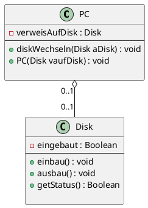
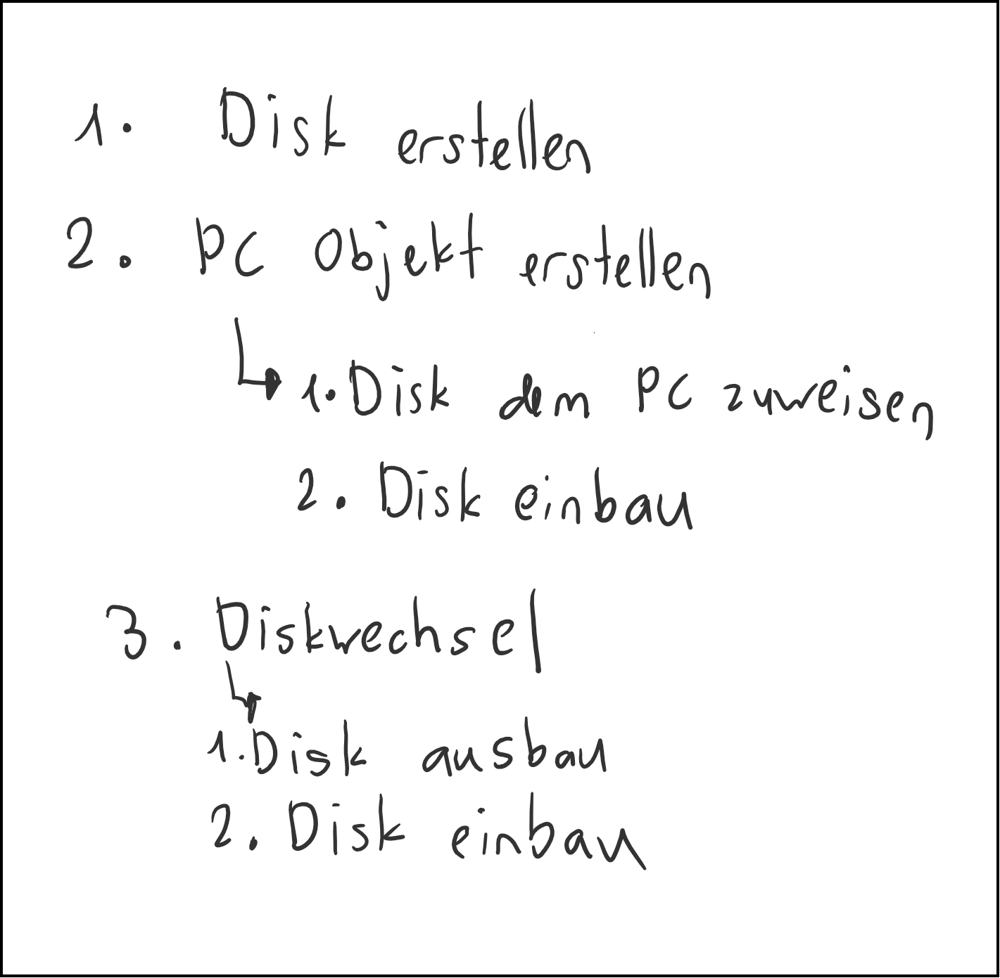

# Inhalte zum Tag 11

## Tätigkeiten
Heute haben wir die G-Prüfung besprochen. Ausserdem haben wir den Unterschied von Assoziation, Aggregation und Komposition kennengelernt. Ich habe die Theorie dazu in der Theorie Sektion aufgeschrieben. Erweitert wurde der Komositionen-Teil.

## Theorie

- [Beziehungen](Theorie/Beziehungen.md)
- [Komposition](Theorie/Beziehungen.md#Komposition)

## Praxisaufgabe

Wir mussten als Praxisbeispiel die Disk Aufgabe machen. Dabei haben wir die Aggregatoin Beziehung kennengelernt und angewendet.

Wir haben das Klassendiagramm ausprogrammiert und die Funktionen dazu geschrieben.



<details>
  <summary><b>Hier Klicken um den Code von PlantUML anzuzeigen.</b></summary>

  ```

@startuml

class PC {
    - verweisAufDisk : Disk
    ---
    + diskWechseln(Disk aDisk) : void
    + PC(Disk vaufDisk) : void

}

class Disk {
    - eingebaut : Boolean
    ---
    + einbau() : void
    + ausbau() : void
    + getStatus() : Boolean

}

PC "0..1" o-- "0..1" Disk

@enduml
```

</details>

Folgendes ist meine Darstellung des Prozesses:



### Ausprogrammierung

**PC.java**

```java
package com.severinboegli;

public class PC {
    private Disk verweisAufDisk;

    public PC(Disk vaufDisk) {
        verweisAufDisk = vaufDisk;
        verweisAufDisk.einbau();

    }

    public void diskWechseln(Disk adisk) {
        verweisAufDisk.ausbau();
        verweisAufDisk = adisk;
        verweisAufDisk.einbau();
    }
}
```

> Die PC Klasse erstellt das PC Objekt und verweist auf ein Disk Objekt.

**Disk.java**
```java
package com.severinboegli;

public class Disk {
    private boolean eingebaut = false;

    public void einbau() {
        if (!eingebaut) {
            eingebaut = true;
        } else {
            System.out.println("Disk ist bereits eingebaut!");
        }
        
    }

    public void ausbau() {
        if (eingebaut) {
            eingebaut = false;
        } else {
            System.out.println("Disk ist bereits ausgebaut!");
        }
    }

    public boolean getStatus() {
        return eingebaut;
    }
}
```

> Die Disk wird vom PC Objekt verwiesen und kann eingebaut oder ausgebaut sein.

**Main.java**
```java
package com.severinboegli;

public class Main {
    public static void main(String[] args) {

        Disk ssd = new Disk();
        Disk hdd = new Disk();
        Disk nvme = new Disk();

        PC pc = new PC(ssd);
        PC pc2 = new PC(hdd);
        // Hier wird eine Meldung kommen, dass die Disk bereits eingebaut ist.
        PC pc3 = new PC(hdd);

        // Die Disk wird mit der vorherigen Disk gewechselt und die vorherige wird wieder ausgebaut.
        pc.diskWechseln(nvme);
    }
}
```