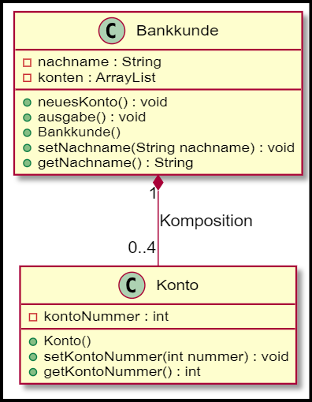

# Inhalte zum Tag 12

## Tätigkeiten
Heute haben wir angeschaut, wie man ein Sequenzdiagramm in PlantUML macht. Das Sequenzdiagramm wird benutzt um den Ablauf mit den verschiedenen Klasse darzustellen.
Wir haben ausserdem die verschiedenen Beziehungen angeschaut und wie sie sich voneinander unterscheiden.

## Theorie

- [Beziehungen](Theorie/Beziehungen.md)
- [Sequenzdiagramm](Theorie/Sequenzdiagramm.md)

## Praxisaufgabe
Als Praxisaufgabe haben wir das Beispiel über Komosition "Banken" gemacht. 
Dabei mussten wir das folgende Klassendiagramm ausprogrammieren:
<br><br>

<br><br>

Dabei sind verschiedene Szenarien zu beachten, die geschützt werden, damit sie nicht eintreffen können. --> eine Kontonummer muss 4-Stellig sein, damit sie gültig ist.

Es gibt insgesamt drei Klassen: Bankkunde, Konto und das Main.

### Bankkunde

```java
package com.severinboegli;

import java.util.ArrayList;
import java.util.Scanner;

public class Bankkunde {
    private Scanner scanner = new Scanner(System.in);
    private String nachname;
    private ArrayList<Konto> konten = new ArrayList<>();

    public void neuesKonto(){
        System.out.println("Konto wird erstellt.");
        if (konten.size() <= 4) {
            System.out.println("Es konnte ein Konto hinzugefügt werden. Bitte geben sie die Kontonummer ein.");
            
            // Create number
            int nummer = 0;

            boolean breakLoop = false;
            while (!breakLoop) {
                try {
                nummer = scanner.nextInt();
                } 
                catch (Exception e) {
                System.out.println("Es ist ein Fehler bei der Eingabe der Nummer entstanden. Bitte geben sie erneuert die Kontonummer ein.");
                breakLoop = false;
                continue;
                }

                if (nummer >= 1000 & nummer < 10000) {
                    breakLoop = true;
                }
                else {
                    System.out.println("Die Zahl ist nicht vierstellig, bitte gib eine vierstellige Zahl ein.");
                }

            }
            
            
            konten.add(new Konto(nummer));
        } else {
            System.out.println("Es wurden bereits vier Konten erstellt, weshalb momentan kein zusätzliches Konto hinzugefügt werden kann.");
        }
    }

    public void ausgabe() {
        System.out.println("Nachname: " + nachname);
        System.out.println("----- Konten anzeigen -----");
        System.out.println("Es sind folgende Konten verfügbar:");
        for (Konto konto : konten) {
            System.out.println("- Kontonummer: " + konto.getKontoNummer());
        }
    }

    public Bankkunde() {
        neuesKonto();
    }

    public void setNachname(String nachname) {
        this.nachname = nachname;
    }

    public String getNachname() {
        return nachname;
    }
}
```

Hier wird ein neuer Kunde erstellt. Dabei wird zuerst überprüft, ob bereits vier Konten erstellt wurden. Wenn nicht, wird eine neue Kontonummer erstellt. Dabei wird überprüft, ob die Kontonummer vierstellig ist. Wenn nicht, wird eine Fehlermeldung ausgegeben und der Benutzer muss eine neue Kontonummer eingeben. Wenn die Kontonummer vierstellig ist, wird das Konto erstellt und der Benutzer wird informiert, dass das Konto erstellt wurde.

### Konto

```java

package com.severinboegli;

public class Konto {
    private int kontoNummer;

    public Konto(int nummer){
        setKontoNummer(nummer);
    }

    public void setKontoNummer(int nummer) {
        if (nummer >= 1000 && nummer <= 9999) {
            this.kontoNummer = nummer;
        } else {
            System.out.println("Ungültige Kontonummer");
            this.kontoNummer = -1;
        }
    }

    public int getKontoNummer() {
        return kontoNummer;
    }
}

```

Hier wird ein neues Konto erstellt mit einfachen Funktionen: getter, setter und Konstruktor.
Die Setter Funktion überprüft, ob die Kontonummer vierstellig ist. Wenn nicht, wird eine Fehlermeldung ausgegeben und die Kontonummer wird auf -1 gesetzt.

### Main

```java
package com.severinboegli;

public class Main {
    public static void main(String[] args) {
        Bankkunde Severin = new Bankkunde();
        Severin.setNachname("Boegli");
        Severin.neuesKonto();

        Bankkunde Antonia = new Bankkunde();
        Antonia.setNachname("Schneider");

        // Es können nur vier Konten erstellt werden, beim 5. Konto wird folgende
        // Meldung angezeigt:
        // --> "Es wurden bereits vier Konten erstellt, weshalb momentan kein
        // zusätzliches Konto hinzugefügt werden kann."
        for (int i = 0; i < 5; i++) {
            Antonia.neuesKonto();
        }

        Severin.ausgabe();
        /*
         * AUSGABE:
         * 
         * ----- Konten anzeigen -----
         * Es sind folgende Konten verfügbar:
         * - Kontonummer: 1002
         * - Kontonummer: 1010
         */

        Antonia.ausgabe();
        /*
         * AUSGABE:
         * 
         * Nachname: Schneider
         * ----- Konten anzeigen -----
         * Es sind folgende Konten verfügbar:
         * - Kontonummer: 1023
         * - Kontonummer: 1054
         * - Kontonummer: 1045
         * - Kontonummer: 1445
         * - Kontonummer: 1050
         */
    }
}

```

In dieser Klasse wird getestet, ob die zwei Klassen als Komposition zusammen funktionieren. Dies ist der Fall, da die Konten nur existieren, wenn ein Kunde existiert. Wenn der Kunde gelöscht wird, werden auch die Konten gelöscht.

> [!TIP] Die Klassen sind am einfachsten auszuprogrammieren, wenn man mit dne Konstruktoren anfängt und dann die Setter und Getter Funktionen erstellt. Mit Hilfe von dem Klassendiaramm ist es sehr schnell und einfach erledigt.