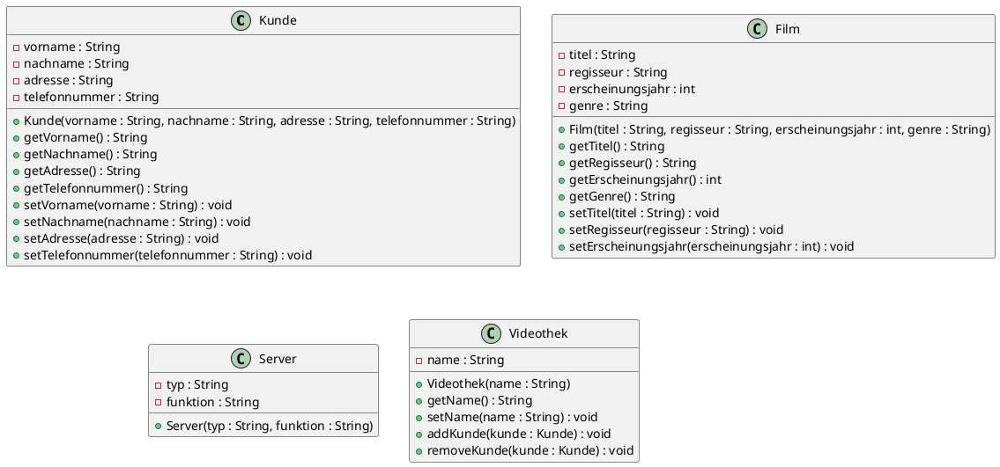
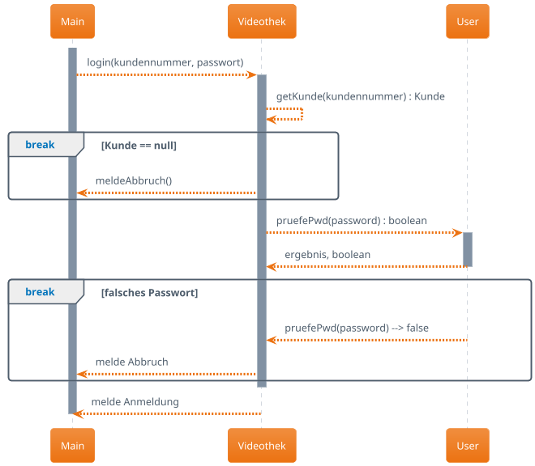

# Inhalte zum Tag 13

## Tätigkeiten
Wir durften heute selbständig an unserem Projekt weiterarbeiten. Ich habe mich mit der Aufgabenstellung beschäftigt und die Klassen für die ToDo-Liste erstellt. Die Klassen sind in der jeweiligen Java Datei dokumentiert.
Wir haben ein Aktivitäsdiagram kennengelernt. Dieses ist in der Datei Aktivitätsdiagramm.md dokumentiert. In einem Aktivitätsdiagramm wird der Ablauf eines Programms dargestellt. Es ist ähnlich wie ein Sequenzdiagramm, jedoch wird hier der Ablauf dargestellt und nicht die Kommunikation zwischen den Klassen.

## Theorie

- [Aktivitätsdiagramm](Theorie/Aktivitätsdiagramm.md)

## Praxisaufgabe
Wir haben eine Aufgabe mit der Videothek gemacht:



<details>
  <summary><b>Hier Klicken um den Code von PlantUML anzuzeigen.</b></summary>

  ```
  @startuml
 
class Kunde {
    - vorname : String
    - nachname : String
    - adresse : String
    - telefonnummer : String
 
    + Kunde(vorname : String, nachname : String, adresse : String, telefonnummer : String)
    + getVorname() : String
    + getNachname() : String
    + getAdresse() : String
    + getTelefonnummer() : String
    + setVorname(vorname : String) : void
    + setNachname(nachname : String) : void
    + setAdresse(adresse : String) : void
    + setTelefonnummer(telefonnummer : String) : void
}
 
class Film {
    - titel : String
    - regisseur : String
    - erscheinungsjahr : int
    - genre : String
 
    + Film(titel : String, regisseur : String, erscheinungsjahr : int, genre : String)
    + getTitel() : String
    + getRegisseur() : String
    + getErscheinungsjahr() : int
    + getGenre() : String
    + setTitel(titel : String) : void
    + setRegisseur(regisseur : String) : void
    + setErscheinungsjahr(erscheinungsjahr : int) : void
 
 
}
 
class Server {
    - typ : String
    - funktion : String
 
    + Server(typ : String, funktion : String)
}
 
class Videothek {
    - name : String
 
    + Videothek(name : String)
    + getName() : String
    + setName(name : String) : void
    + addKunde(kunde : Kunde) : void
    + removeKunde(kunde : Kunde) : void
}
@enduml
  
  
  ```

</details>





<details>
  <summary><b>Hier Klicken um den Code von PlantUML anzuzeigen.</b></summary>

  ```
@startuml
!theme aws-orange

participant Main
participant Videothek
participant User

activate Main

Main --> Videothek : login(kundennummer, passwort)

activate Videothek

Videothek --> Videothek : getKunde(kundennummer) : Kunde

break Kunde == null
Videothek --> Main : meldeAbbruch()
end

Videothek --> User : pruefePwd(password) : boolean
activate User
User --> Videothek: ergebnis, boolean
deactivate User

break falsches Passwort
User --> Videothek : pruefePwd(password) --> false
Videothek --> Main : melde Abbruch
end

deactivate Videothek

Videothek --> Main : melde Anmeldung

deactivate Main

@enduml
  ```

</details>
