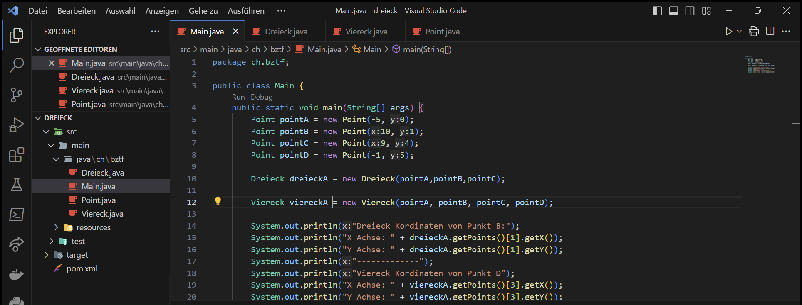

# Inhalte zum Tag 3



## Tätigkeiten
> Java Formenprojekt weiterprogrammiert

Heute habe ich an dem Formenprojekt weiterprogrammiert und die Lineare Funktion implementiert. Diese Funktion prüft ob anhand von drei Punkten auf dem Koordinaten ob eine Funktion möglich ist oder nicht. Dies wird mit einer Linearen Funktion getestet und konnte auch für das Viereck übernommen werden.

## Theorie
Heute habe ich zu folgenden Themen eine Theorie aufgeschrieben:
- [Zugriffsmodifizierer](Theorie/Zugriffsmodifizierer)


## Programmieraufgabe

Ich habe bei der Programmieraufgabe das Projekt von letzter Woche weiterprogrammiert. Dies habe ich verfeinert, indem ich bei den Setter einen Filter gesetzt habe, der auf die Gültigkeit der Klassen prüft.


> Point.java Klasse
```java
package ch.bztf;

public class Point {
    private double x = 0;
    private double y = 0;

    public Point (double x, double y){
        setX(x);
        setY(y);
    }

    public Point() {
        this.x = 0;
        this.y = 0;
    }

    public void setX(double x) {
        this.x = validate(x);
    }

    public void setY(double y) {
        this.y = validate(y);
    }

    public double getX() {
        return x;
    }

    public double getY() {
        return y;
    }

    public double[] getCordinates() {
        return new double[]{x,y};
    }

    public boolean equals(Point point){
        return this.getX() == point.getX() && this.getY() == point.getY();
    }

    private double validate(double value){
        if (value <= 100 && value >= -100) {
            return value;
        } else {
            System.out.println("Warning! Value is not between -100 and 100");
            System.out.println("Value is set to 0");
            return 0;
        }

    }
}
```

> Viereck.java Klasse
```java
package ch.bztf;

public class Viereck {
    private Point[] points;

    public Viereck(Point a, Point b, Point c, Point d){
        setPoints(a, b, c, d);
    }

    public void setPoints(Point a, Point b, Point c, Point d) {
        if (validateSquare(a, b, c, d)){
            this.points = new Point[]{a,b,c,d};
            System.out.println("Möglich");
        } else {
            System.out.println("Koordinaten sind auf einer Gerade");
        }
    }

    public Point[] getPoints() {
        return points;
    }

    /* Prüft alle möglichen Kombinationen, um mit drei der vier Punkte ein Dreieck zu bilden. */
    private boolean validateSquare(Point a, Point b, Point c, Point d) {
        if (!validateTriangle(b, c, d)) {
                return false;
            }

        if (!validateTriangle(a, c, d)) {
                return false;
            }
            
            
        if (!validateTriangle(a, b, d)) {
                return false;
            }
            
        if (!validateTriangle(a, b, c)) {
                return false;
            }    

        return true;
    }

    /* Damit ein Dreieck möglich ist, muss beim Viereck ebenfalls ein Dreieck möglich sein, wenn man einen Punkt entfernt. */
    private boolean validateTriangle(Point a, Point b, Point c) {
        if (a.getX() != b.getX()) {
            double[] value = linearFunction(a, b);
            if (calcFunction(c.getX(), value[0], value[1]) == c.getY()) {
                return false;
            }
            else {
                return true;
            }
        } 

        else if(a.getX() != c.getX()) {
            double[] value = linearFunction(a, c);
            if (calcFunction(b.getX(), value[0], value[1]) == b.getY()) {
                return false;
            }
            else {
                return true;
            }
        } 

        else {
            return false;
        }
    }

    private double[] linearFunction(Point firstPoint, Point secondPoint ){
        double m = (firstPoint.getY()-secondPoint.getY()) / (firstPoint.getX() - secondPoint.getX());
        double q = firstPoint.getY() - (m * firstPoint.getX());

        return new double[]{m,q};
    }

    private  double calcFunction(double value, double m, double q) {
        return value*m + q;
    } 
}
```

> Dreieck.java Klasse
```java
package ch.bztf;

public class Dreieck {
    private Point[] points;

    public Dreieck(Point a, Point b, Point c) {
        setPoints(a, b, c);
    }

    public Point[] getPoints() {
        return points;
    }

    public void setPoints(Point a, Point b, Point c) {
       if (validateTriangle(a, b, c)){
            this.points = new Point[]{a,b,c};
            System.out.println("Möglich");
        } else {
            System.out.println("Koordinaten sind auf einer Gerade");
        }
    }

    private boolean validateTriangle(Point a, Point b, Point c) {
        if (a.getX() != b.getX()) {
            double[] value = linearFunction(a, b);
            if (calcFunction(c.getX(), value[0], value[1]) == c.getY()) {
                return false;
            }
            else {
                return true;
            }
        } 
        else if(a.getX() != c.getX()) {
            double[] value = linearFunction(a, c);
            if (calcFunction(b.getX(), value[0], value[1]) == b.getY()) {
                return false;
            }
            else {
                return true;
            }
        } 
        else {
            return false;
        }
    }

    private double[] linearFunction(Point firstPoint, Point secondPoint ){
        double m = (firstPoint.getY()-secondPoint.getY()) / (firstPoint.getX() - secondPoint.getX());
        double q = firstPoint.getY() - (m * firstPoint.getX());
        return new double[]{m,q};
    }

    private  double calcFunction(double value, double m, double q) {
        return value*m + q;
    }

    public String getPointsToString() {
        String text = "Koordinaten: \n";
        for (int i = 0; i < points.length; i++) {
            text += "X: " + points[i].getX() + " | Y: " + points[i].getY() + "\n";
        }
        return text;
    }
}

```

> Main.java Klasse
```java
package ch.bztf;

public class Main {
    public static void main(String[] args) {
        Point pointA = new Point(1, 12);
        Point pointB = new Point(5, 52);
        Point pointC = new Point(1, 22);
        Point pointD = new Point(-2, -8);
        Point pointE = new Point(-1, -8);
        Point pointF = new Point(-102, -8);

        //Dreieck dreieckA = new Dreieck(pointA,pointB,pointC);

        Viereck viereckA = new Viereck(pointA, pointB, pointC, pointD);

        Dreieck dreieck = new Dreieck(pointA, pointB, pointC);
        System.out.println("Koordinaten des ersten Dreiecks: ");
        System.out.println(dreieck.getPointsToString());

        System.out.println("Koordinaten des zweiten Dreiecks: (Abänderung auf eine Gerade, was nicht möglich ist)");
        dreieck.setPoints(pointA, pointB, pointE);
        System.out.println(dreieck.getPointsToString());

        System.out.println("Koordinaten des dritten Dreiecks: (nach möglicher Abänderung)");
        dreieck.setPoints(pointA, pointB, pointD);
        System.out.println(dreieck.getPointsToString());
    }
}
```
