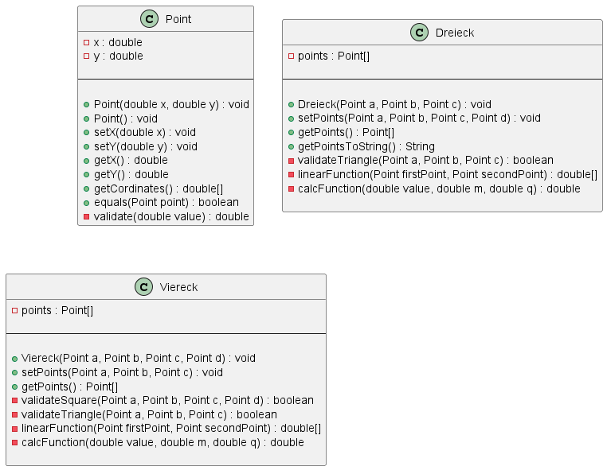

# Inhalte zum Tag 3

## Tätigkeiten
> Java Kontoprojekt anfangen
> PlantUML erstellt

Heute habe ich das Konto Projekt angefangen. Dies machte ich bis und mit Schritt 5 weiter.

Ich habe ausserdem das PlantUML für das Formenprojekt erstellt. Diese sieht wie folgt aus.



## Theorie
Ich habe nur Theoriefragen beantwortet:

**Meine Notizen dazu:**
<div class="question-box">
  Was passiert wenn kein Konstruktor erstellt wird?
</div>
<br>
Die Klasse wird mit einem Standardkonstruktor erstellt.
<br><br>
<div class="question-box">
  Was bedeutet "ein Instanz erstellen"?
</div>
<br>
Ein Objekt nach gewissem Bauplan erstellen.
<br><br>
<div class="question-box">
  Ist die Variable instanzTestKonto1 eine Variable oder eine Referenz?
</div>
<br>
Dies ist eine Variabel, da das Objekt mit "new" inizialisiert worden ist.
<br><br>
<div class="question-box">
  Was passiert technisch im Speicher, wenn Sie instanzTestKonto1 = instanzTestKonto machen?
</div>
<br>
Der Pointer von instanzTestKonto zeigt nun auf instanzTestKonto1. Nun hängen beide zusammen und wird eine Referenz verändert, wird auch die andere Verändert.
<br>


## Programmieraufgabe

Bei der Programieraufgabe habe ich den Auftrag Konto01 gemacht. Dieser Auftrag war eine Art Mischung aus Fragen und Praxis.

folgend noch den Code dazu:

```java
public class Konto {
    private String kontoInhaber;
    private String nameKonto;
    private int nummerKonto;
    private double saldoKonto;

    public Konto(String kontoInhaber, String nameKonto, int nummerKonto, double saldoKonto) {
        setKontoInhaber(kontoInhaber);
        setNameKonto(nameKonto);
        setNummerKonto(nummerKonto);
        setSaldoKonto(saldoKonto);
    }

    public void setKontoInhaber(String kontoInhaber){
        this.kontoInhaber = kontoInhaber;
    }

    public void setNameKonto(String nameKonto) {
        this.nameKonto = nameKonto;
    }

    public void setNummerKonto(int nummerKonto) {
        this.nummerKonto = nummerKonto;
    }

    public void setSaldoKonto(double saldoKonto) {
        this.saldoKonto = saldoKonto;
    }

    public String getKontoInhaber() {
        return kontoInhaber;
    }
    
    public String getNameKonto() {
        return nameKonto;
    }
    
    public int getNummerKonto() {
        return nummerKonto;
    }

    public double getSaldoKonto() {
        return saldoKonto;
    }

}
```