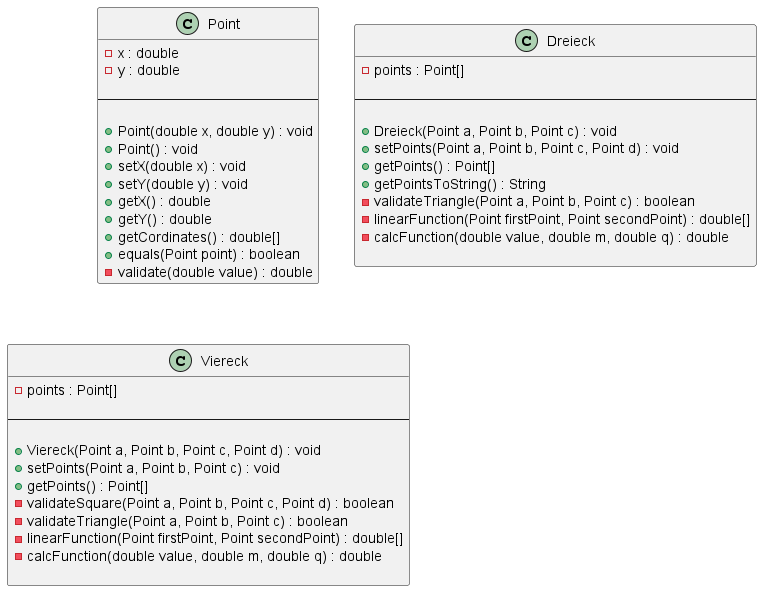

# Inhalte zum Tag 4

## Tätigkeiten
> Java Kontoprojekt anfangen
> PlantUML erstellt

Heute habe ich das Konto Projekt angefangen. Dies machte ich bis und mit Schritt 5 weiter.

Ich habe ausserdem das PlantUML für das Formenprojekt erstellt. Diese sieht wie folgt aus.



## Theorie
Ich habe nur Theoriefragen beantwortet. Die Fragen wurden unter folgenden Punkten beantwortet.
- [Zugriffsmodifizierer](Theorie/Zugriffsmodifizierer.md)
- [Konstruktoren](Theorie/Konstruktoren.md)
- [Referenzen_Vergleich](Theorie/Referenzen_Vergleich.md)


## Programmieraufgabe

Bei der Programieraufgabe habe ich den Auftrag Konto01 gemacht. Dieser Auftrag war eine Art Mischung aus Fragen und Praxis. In der Main Klasse können nun nur die Getter, Setter und der Konstruktor aufgerufen werden, da alle Attribute als private dekliniert wurden.

folgend noch den Code dazu:

> Konto.java
```java
public class Konto {
    private String kontoInhaber;
    private String nameKonto;
    private int nummerKonto;
    private double saldoKonto;

    public Konto(String kontoInhaber, String nameKonto, int nummerKonto, double saldoKonto) {
        setKontoInhaber(kontoInhaber);
        setNameKonto(nameKonto);
        setNummerKonto(nummerKonto);
        setSaldoKonto(saldoKonto);
    }

    public void setKontoInhaber(String kontoInhaber){
        this.kontoInhaber = kontoInhaber;
    }

    public void setNameKonto(String nameKonto) {
        this.nameKonto = nameKonto;
    }

    public void setNummerKonto(int nummerKonto) {
        this.nummerKonto = nummerKonto;
    }

    public void setSaldoKonto(double saldoKonto) {
        this.saldoKonto = saldoKonto;
    }

    public String getKontoInhaber() {
        return kontoInhaber;
    }
    
    public String getNameKonto() {
        return nameKonto;
    }
    
    public int getNummerKonto() {
        return nummerKonto;
    }

    public double getSaldoKonto() {
        return saldoKonto;
    }

}
```

> Main.java
```java
package ch.severinboegli;

public class Main {
    public static void main(String[] args) {
        Konto instanzTestKonto = new Konto("Severin", "Sparkonto", 100, 23.3);
        Konto instanzTestKonto01 = new Konto("Hans", "Hauptkonto", 101, 300.34);

        instanzTestKonto01 = instanzTestKonto;
        
        System.out.println("Ausgabe sollte gleich sein:");
        System.out.println("InstanzTestKonto Guthaben:" + instanzTestKonto.getSaldoKonto());
        System.out.println("InstanzTestKonto1 Guthaben: " + instanzTestKonto01.getSaldoKonto());
    }
}
```