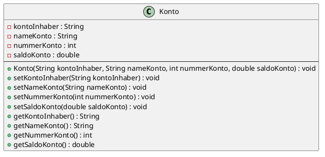
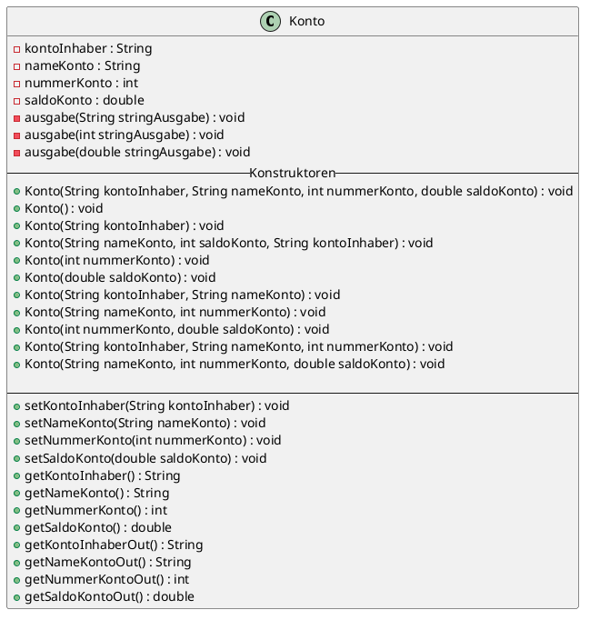

# Inhalte zum Tag 5

## Tätigkeiten
> Konto01 & Konto02 ausprogrammiert, dokumentiert & PlantUML erstellt.

Am Tag 5 habe ich das Konto01 abgeschlossen mit dem PlantUML und zum Konto02 Theorie und Praxisaufgabe erledigt. Im Unterricht haben wir noch behandelt was Singletons sind, über dies habe ich im Theorieteil ebenfalls eine Seite gewitmet.

--> Singleton ist eine interessante Art wie man sicherstellen kann, dass nur ein Objekt von einer Klases erstellt werden kann.


## Theorie
- [Singleton](Theorie/Singleton.md)

## Praxisauftrag

### Abschliessender Code für Konto01

> Main.java

```java
package ch.severinboegli;

import java.util.Scanner;

public class Main {
    
    public static void main(String[] args) {
        Scanner scanner = new Scanner(System.in);
        Konto konto01 = new Konto("Severin", "Sparkonto", 100, 50);

        System.out.println("Momentaner Kontostand: " + konto01.getSaldoKonto());
        System.out.println("Wie viel Geld möchten sie schon einzahlen?");
        double saldo = scanner.nextDouble();
        konto01.setSaldoKonto(konto01.getSaldoKonto()+ saldo);

        System.out.println("Information zum Konto01");
        System.out.println("Kontoinhaber:" + konto01.getKontoInhaber());
        System.out.println("Kontoname: " + konto01.getNameKonto());
        System.out.println("Kontonummer: " + konto01.getNummerKonto());
        System.out.println("Saldo des Kontos: " + konto01.getSaldoKonto());
    }
}
```

> Konto.java

```java
package ch.severinboegli;

public class Konto {
    private String kontoInhaber;
    private String nameKonto;
    private int nummerKonto;
    private double saldoKonto;

    public Konto(String kontoInhaber, String nameKonto, int nummerKonto, double saldoKonto) {
        setKontoInhaber(kontoInhaber);
        setNameKonto(nameKonto);
        setNummerKonto(nummerKonto);
        setSaldoKonto(saldoKonto);
    }

    public void setKontoInhaber(String kontoInhaber){
        this.kontoInhaber = kontoInhaber;
    }

    public void setNameKonto(String nameKonto) {
        this.nameKonto = nameKonto;
    }

    public void setNummerKonto(int nummerKonto) {
        this.nummerKonto = nummerKonto;
    }

    public void setSaldoKonto(double saldoKonto) {
        this.saldoKonto = saldoKonto;
    }

    public String getKontoInhaber() {
        return kontoInhaber;
    }
    
    public String getNameKonto() {
        return nameKonto;
    }
    
    public int getNummerKonto() {
        return nummerKonto;
    }

    public double getSaldoKonto() {
        return saldoKonto;
    }

}
```

### PlantUML aus Konto01
Das Fertig PlantUML aus der Aufgabe vom Konto01 sieht wie folgt aus:


### Schrittausführung für Konto02

**Erstellung vieler Konstruktoren für Konto:**
Um herauszufinden, wie viele Konstruktoren möglich sind, muss man wissen, wie viele Parameter maximal im Konstruktor übergeben werden.
*Max Anzahl Parameter: 4*
> Rechnung: 2^4 = 16
> Jeder Parameter kann übergeben werden oder nicht ( 0 / 1)
> Die Anzahl ist jedoch kleiner --> Konstruktor(String name) & Konstruktor(String adresse)
> Dieses Beispiel ist nicht möglich, da bei beiden Konstruktoren der gleiche Datentyp übergeben wird.

```java
public Konto(String kontoInhaber, String nameKonto, int nummerKonto, double saldoKonto) {
        setKontoInhaber(kontoInhaber);
        setNameKonto(nameKonto);
        setNummerKonto(nummerKonto);
        setSaldoKonto(saldoKonto);
    }

    public Konto() {
        setKontoInhaber("Severin");
        setNameKonto("Konto");
        setNummerKonto(100);
        setSaldoKonto(0);
    }

    public Konto(String kontoInhaber) {
        setKontoInhaber(kontoInhaber);
        setNameKonto("Konto");
        setNummerKonto(100);
        setSaldoKonto(0);
    }

    public Konto(String nameKonto, int saldoKonto, String kontoInhaber) {
        setKontoInhaber(kontoInhaber);
        setNameKonto(nameKonto);
        setNummerKonto(100);
        setSaldoKonto(saldoKonto);
    }

    public Konto(int nummerKonto) {
        setKontoInhaber("Severin");
        setNameKonto("Konto");
        setNummerKonto(nummerKonto);
        setSaldoKonto(0);
    }

    public Konto(double saldoKonto) {
        setKontoInhaber("Severin");
        setNameKonto("Konto");
        setNummerKonto(100);
        setSaldoKonto(saldoKonto);
    }

    public Konto(String kontoInhaber, String nameKonto) {
        setKontoInhaber(kontoInhaber);
        setNameKonto(nameKonto);
        setNummerKonto(100);
        setSaldoKonto(0);
    }

    public Konto(String nameKonto, int nummerKonto) {
        setKontoInhaber("Severin");
        setNameKonto(nameKonto);
        setNummerKonto(nummerKonto);
        setSaldoKonto(0);
    }

    public Konto(int nummerKonto, double saldoKonto) {
        setKontoInhaber("Severin");
        setNameKonto("Konto");
        setNummerKonto(nummerKonto);
        setSaldoKonto(saldoKonto);
    }

    public Konto(String kontoInhaber, String nameKonto, int nummerKonto) {
        setKontoInhaber(kontoInhaber);
        setNameKonto(nameKonto);
        setNummerKonto(nummerKonto);
        setSaldoKonto(0);
    }

    public Konto(String nameKonto, int nummerKonto, double saldoKonto) {
        setKontoInhaber("Severin");
        setNameKonto(nameKonto);
        setNummerKonto(nummerKonto);
        setSaldoKonto(saldoKonto);
    }
```

**Fragen**

<div class="question-box">
    Wie funktioniert überladen von Methoden/Konstrukturen?
</div><br>
Eine kurze Erklährung wie Konstruktoren funktionieren, findet man unter:

[Konstruktoren](Theorie/Konstruktoren.md)

<div class="question-box">
    Woraus besteht eine Signatur einer Methode?
</div><br>
Dies beschreibe ich unter:

[Methoden](Theorie/SetterGetter?id=methodensignatur)

<div class="question-box">
    Weshalb wurde in der Vorlage mit this. gearbeitet?
</div><br>

Weil zwei Variabeln mit dem gleichen Namen erstellt wurden und Java wissen muss, welche Variabel gemeint ist.

In der Vorlage wurde mit ```this``` gearbeitet, da this auf die aktuelle Klasse verlinkt. Konkreter:

```java
public Konto(String kkontoInhaber, String knameKonto, int nummerKonto, double saldoKonto)
{
    kontoInhaber = kkontoInhaber;
    nameKonto = knameKonto;
    this.nummerKonto = nummerKonto; // nummerKonto --> greift auf die Übergabe zu
    this.saldoKonto = saldoKonto; // this.saldoKonto --> greift auf die definierte Variabel in der Klasse zu.
}
```
Im obigen Beispiel wurde mit ```this``` gearbeitet, damit man weiss, dass das Attribut auf das Klassenattribut und nicht auf das Attribut der Methode zugreiffen will.

**getMethodOut()**

> Neuer Code aus Konto.java

```java
    private void ausgabe(String stringAusgabe) {
        System.out.println(stringAusgabe);
    }

    private void ausgabe(int stringAusgabe) {
        System.out.println(stringAusgabe);
    }

    private void ausgabe(double stringAusgabe) {
        System.out.println(stringAusgabe);
    }
    
    public String getKontoInhaberOut()
    {
        ausgabe(kontoInhaber);
        return kontoInhaber;
    }

    public String getNameKontoOut(){
        ausgabe(nameKonto);
        return nameKonto;
    }

    public int getNummerKontoOut() {
        ausgabe(nummerKonto);
        return nummerKonto;
    }

    public double getSaldoKontoOut() {
        ausgabe(saldoKonto);
        return saldoKonto;
    }
```

**Problematik:**

Ein Problem, dass ich hatte war es, dass ich die Methode "ausgabe" nur mit einem String füllen konnte. Für das musste ich mit Überladung arbeiten. Ich erstelle zwei weitere Methoden für double und int.

> Main.java

```java
package ch.severinboegli;

import java.util.Scanner;

public class Main {
    
    public static void main(String[] args) {
        Scanner scanner = new Scanner(System.in);
        Konto kt01 = new Konto("Goldfinger","Debitor", 3000, 1.0000000006667E11);
        Konto konto01 = new Konto("Severin", "Sparkonto", 100, 50);
        Konto konto02 = new Konto();
        Konto konto03 = new Konto("Severin");
        Konto konto04 = new Konto(200, 100.05);

        System.out.println("Kontoinhaber: ");
        kt01.getKontoInhaberOut();
        System.out.println("Namekonto: ");
        kt01.getNameKontoOut();
        System.out.println("Kontonummer: ");
        kt01.getNummerKontoOut();
        System.out.println("Saldo: ");
        kt01.getSaldoKontoOut();
    }
}
```

### PlantUML für Konto02
Wie für das Konto01 wurde auch für das Konto02 ein PlantUML erstellt. Diese PlantUML sehr ähnlich wie das von Konto02, es beinhaltet lediglich mehr Methoden.

