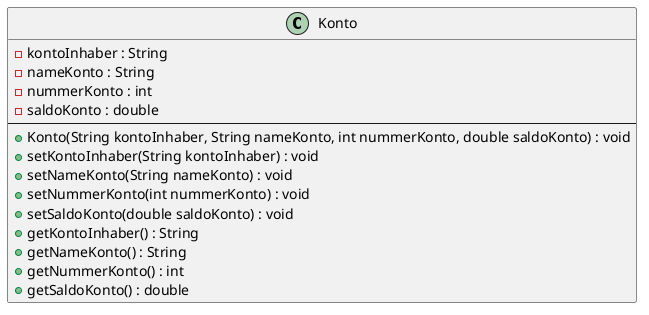

# Inhalte zum Tag 5

## Tätigkeiten
> Konto01 & Konto02 ausprogrammiert, dokumentiert & PlantUML erstellt.

Am Tag 5 habe ich das Konto01 abgeschlossen mit dem PlantUML und zum Konto02 Theorie und Praxisaufgabe erledigt. Im Unterricht haben wir noch behandelt was Singletons sind, über dies habe ich im Theorieteil ebenfalls eine Seite gewitmet.

--> Singleton ist eine interessante Art wie man sicherstellen kann, dass nur ein Objekt von einer Klases erstellt werden kann.


## Theorie
- [Singleton](Theorie/Singleton.md)

## Praxisauftrag

### Abschliessender Code für Konto01

> Main.java

```java
package ch.severinboegli;

import java.util.Scanner;

public class Main {
    
    public static void main(String[] args) {
        Scanner scanner = new Scanner(System.in);
        Konto konto01 = new Konto("Severin", "Sparkonto", 100, 50);

        System.out.println("Momentaner Kontostand: " + konto01.getSaldoKonto());
        System.out.println("Wie viel Geld möchten sie schon einzahlen?");
        double saldo = scanner.nextDouble();
        konto01.setSaldoKonto(konto01.getSaldoKonto()+ saldo);

        System.out.println("Information zum Konto01");
        System.out.println("Kontoinhaber:" + konto01.getKontoInhaber());
        System.out.println("Kontoname: " + konto01.getNameKonto());
        System.out.println("Kontonummer: " + konto01.getNummerKonto());
        System.out.println("Saldo des Kontos: " + konto01.getSaldoKonto());
    }
}
```

> Konto.java

```java
package ch.severinboegli;

public class Konto {
    private String kontoInhaber;
    private String nameKonto;
    private int nummerKonto;
    private double saldoKonto;

    public Konto(String kontoInhaber, String nameKonto, int nummerKonto, double saldoKonto) {
        setKontoInhaber(kontoInhaber);
        setNameKonto(nameKonto);
        setNummerKonto(nummerKonto);
        setSaldoKonto(saldoKonto);
    }

    public void setKontoInhaber(String kontoInhaber){
        this.kontoInhaber = kontoInhaber;
    }

    public void setNameKonto(String nameKonto) {
        this.nameKonto = nameKonto;
    }

    public void setNummerKonto(int nummerKonto) {
        this.nummerKonto = nummerKonto;
    }

    public void setSaldoKonto(double saldoKonto) {
        this.saldoKonto = saldoKonto;
    }

    public String getKontoInhaber() {
        return kontoInhaber;
    }
    
    public String getNameKonto() {
        return nameKonto;
    }
    
    public int getNummerKonto() {
        return nummerKonto;
    }

    public double getSaldoKonto() {
        return saldoKonto;
    }

}
```

### PlantUML aus Konto01
Das Fertig PlantUML aus der Aufgabe vom Konto01 sieht wie folgt aus:


### Schrittausführung für Konto02

Anzahl Konstruktoren --> 2^5 = 32 --> Jedes bit 0 oder 1 fünf Bits