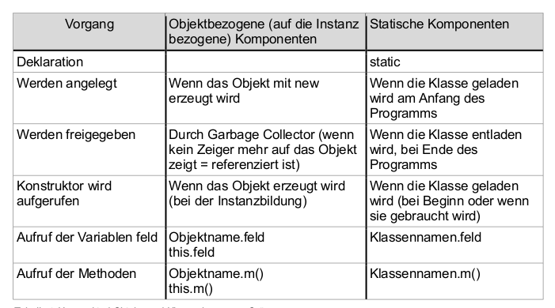

# Inhalte zum Tag 6

## Tätigkeiten
Heute habe ich Das Konto03 bearbeitet. 


## Theorie
Heute habe ich keine Theorie gelernt, respektive noch gelernt. Die [Singleton](Theorie/Singleton.md) Theorie habe ich bereits letztes Mal dokumentiert.

## Praxisauftrag

### Schritt 1.1

Ich erstelle wie laut Auftrag eine private int-Variabel ```anzahlInstanzen```

> Ausschnitt aus Konto.java

```java
public class Konto {
    private static int anzahlInstanzen; // statische Variabel
    private String kontoInhaber;
    private String nameKonto;
    private int nummerKonto;
    private double saldoKonto;

    ...
}
```

<br>
<div class="question-box">
    Welche anderen Anwendungen sind Ihnen noch zu statischen Variablen bekannt? Beispiele?
</div><br>

Eine weitere Möglichkeit um statische Variablen zu verwenden, ist es, wann man einen Wert für eine Klasse selbst speichern möchte. Hier wird der Wert nicht in der Instanz gespeichert, sondern auf der Klasse. Mit final und static werden fixe Werte gesetzt, die nicht verändert werden. ```Math.PI``` ist ein typisches Beispiel für eine statische Variabel.
Weiteres findet man unter [Statisch](Theorie/Zugriffsmodifizierer?id=static).

<br>
<div class="question-box">
    Wenn eine Variable statisch ist - können alle Methoden auf diese statische Variable zugreifen?
</div><br>

Wenn eine Methode statisch ist, können nicht automatisch alle Methoden darauf zugeifen. Dies ist immer noch abhängig vom [Zugriffsmodifizierer](Theorie/Zugriffsmodifizierer.md). Wenn die Variabel statisch aber private ist, können nur Methoden in der Klasse darauf zugreifen. Ist die Variabel public, können alle Methoden darauf zugreifen.

### Schritt 1.2 & Schritt 1.3

Nach jeder Instanzerstellung sollte sich die Variabel ```anzahlInstanzen``` erhöhen.
Zudem sollte eine Methode benutzt werden, die ausgibt, wie viele Instanzen von Konto erstellt worden sind.

> Ausschnitt aus Konto.java

```java
...

private static int anzahlInstanzen = 0;
    private String kontoInhaber;
    private String nameKonto;
    private int nummerKonto;
    private double saldoKonto;


public Konto(String kontoInhaber, String nameKonto, int nummerKonto, double saldoKonto) {
        setKontoInhaber(kontoInhaber);
        setNameKonto(nameKonto);
        setNummerKonto(nummerKonto);
        setSaldoKonto(saldoKonto);
        anzahlInstanzen++; // <-- Hier wird die Anzahl Instanzen erhöht.
    }

...
...    

public static void ausgabeAnzahlInstanzen() {
        System.out.println("Anzahl Kontoinstanzen: " + anzahlInstanzen);
    }
...    
```

> Main.java

```java
public class Main {
    
    public static void main(String[] args) {
        Scanner scanner = new Scanner(System.in);
        Konto kt01 = new Konto("Goldfinger","Debitor", 3000, 1.0000000006667E11);
        Konto konto01 = new Konto("Severin", "Sparkonto", 100, 50);
        Konto konto02 = new Konto();
        Konto konto03 = new Konto("Severin");
        Konto konto04 = new Konto(200, 100.05);

        System.out.println("Kontoinhaber: ");
        kt01.getKontoInhaberOut();
        System.out.println("Namekonto: ");
        kt01.getNameKontoOut();
        System.out.println("Kontonummer: ");
        kt01.getNummerKontoOut();
        System.out.println("Saldo: ");
        kt01.getSaldoKontoOut();

        Konto.ausgabeAnzahlInstanzen();
    }
}
```

Um die Anzahl Instanzen zu zählen, wird in jedem Konstruktor ```anzahlInstanzen++``` eingefügt, was bei jedem Erstellen einer neuen Instanz den Wert um eines erhöht. ```ausgabeAnzahlInstanzen``` wird die Anzahl Instanzen ausgegeben. Diese muss **public** sein, da man auch ausserhalb der Klasse darauf zugreifen will. Die Methode sollte auch **statisch** sein, da man diese auch aufrufen will, ohne dem Erstellen einer Instanz.



Die obige Grafik ist eine schöne Darstellung, die den Unterschied zwischen statisch und Objektbezogene Komponenten darstellt.

> Merken --> Statische Komponenten werden nur einmal geladen. In der Regel erfolgt dies zu Begin eines Programms.
> Statische Aufrufe können mit dem Klassenname.Methode ausgeführt werden.


### Code auf Konto03

> Ausschnitt aus Konto.java

```java
public class Konto {
    private static int anzahlInstanzen = 0;
    private String kontoInhaber;
    private String nameKonto;
    private int nummerKonto;
    private double saldoKonto;

    ...
    ...

    public static Konto createKonto() {
        Scanner scanner = new Scanner(System.in);
        System.out.println("Konto wird erstellt:");
        System.out.println("Wie lautet der Name des Kontoinhaber?");
        String kontoinhaber = scanner.nextLine();
        System.out.println("Wie lautet das Konto?");
        String nameKonto = scanner.nextLine();
        System.out.println("Welche Nummer hat das Konto?");
        int nummerKonto = scanner.nextInt();
        System.out.println("Wie hoch ist der momentane Saldo?");
        double saldoKonto = scanner.nextDouble();

        while (!isPossitiv(saldoKonto)) {
            System.out.println("Fehler, Zahl konnte nicht angenommen werden (ist negativ)");
            System.out.println("Wie hoch ist der momentane Saldo?");
            saldoKonto = scanner.nextDouble();
        }


        return new Konto(kontoinhaber, nameKonto, nummerKonto, saldoKonto);
    }

    public static void ausgabeAnzahlInstanzen() {
        System.out.println("Anzahl Kontoinstanzen: " + anzahlInstanzen);
    }

    private static boolean isPossitiv(double saldo){
        return saldo >= 0;
    }

    public static void makeGreeting(){
        System.out.println("Guten Tag!");
    }

    public static void makeGreeting(int anzahl) {
        for (int i = 0; i < anzahl; i++) {
            System.out.println("Guten Tag!");
        }
    }
}
```

> Main.java

```java
public class Main {
    
    public static void main(String[] args) {
        Konto.makeGreeting();

        ArrayList<Konto> kontos = new ArrayList<>();
        for (int i = 0; i < 3; i++) {
            kontos.add(Konto.createKonto());
        }

        System.out.println("Anzeigen Aller Konto");
        for (int i = 0; i < kontos.size(); i++) {
            System.out.println("Inhaber: " + kontos.get(i).getKontoInhaber());
            System.out.println("Kontoname: " + kontos.get(i).getNameKonto());
            System.out.println("Kontonummer: " + kontos.get(i).getNummerKonto());
            System.out.println("Saldo vom Konto:" + kontos.get(i).getSaldoKonto());
            System.out.println("------------");
        }

        Konto.makeGreeting(3);
        Konto.ausgabeAnzahlInstanzen();
    }
}
```

Da ich nun eine Funktion habe, die mit Benutzereingabe neue Kontos erstellt, kann ich nun dynamisch Konto inizialisieren, ohne dass ich jedes mal einen neuen Benutzer erstellen muss.

Die Funktion "createKonto()" wird benutzt, um ein Konto zu erstellen, von einem Benutzerinput. Das erstellte Konto wird in einer Arraylist gespeichert. Die Arraylist kann ich nun mit einem For-Loop ausgeben.


