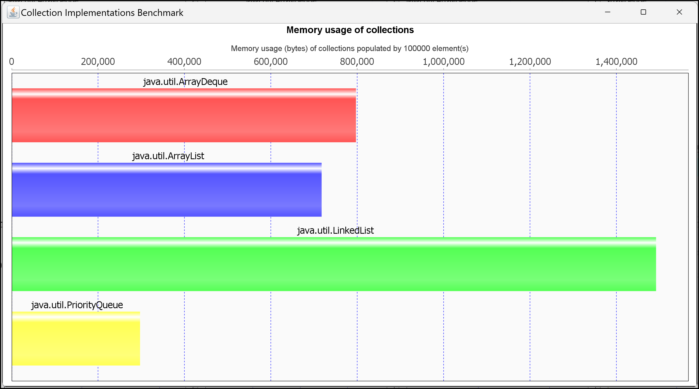

# Inhalte zum Tag 8


## Tätigkeiten

Ich habe heute die Verschiedenen Collection API kennengelernt. Ich habe dazu eine Praxisaufgabe erstellt.
Des Weiteren habe ich eine Übersicht über die verschiedenen Eigenschaften von Collections erstellt.
Ein Benchmark von Github habe ich implementiert, um die Geschwindigkeit der verschiedenen Collections zu vergleichen.




## Theorie
Ich habe heute die Theorie zu den Collections API geschrieben. Ich habe die verschiedenen Eigenschaften von Collections aufgelistet und beschrieben.

- [Collections API](Theorie/Collections_API.md)

## Praxisaufgabe

> Lösung zu Collections 1.1 & 1.2


```java
package com.severinboegli;

import java.util.ArrayList;
import java.util.LinkedList;

public class Main {
    public static void main(String[] args) {
        /**
         * ----------- ArrayList -----------------
         */
        ArrayList<String> faecher = new ArrayList<String>();
        faecher.add("Mathe");
        faecher.add("Informatik");
        faecher.add("Sport"); // Element hinzufügen

        System.out.print("Meine Lieblingsfächer sind: ");
        for (int i = 0; i < faecher.size(); i++) { // Durch jedes Element durchloopen
            System.out.print(" " + faecher.get(i));
        }

        faecher.set(0, "Programmierung"); // Wert abändern

        /*
         * ------------ LinkedList -----------------
         */
        LinkedList<String> faechers = new LinkedList<>();
        faechers.add("Mathe");
        faechers.add("Informatik");
        faechers.add("Sport"); // Elemente hinzufügen

        System.out.print("Meine Lieblingsfächer sind: ");
        for (int i = 0; i < faecher.size(); i++) { // Durch jedes Element durchloopen
            System.out.print(" " + faecher.get(i));
        }

        faecher.set(0, "Programmierung"); // Wert abändern
    }
}
```


> Lösung zu Aufgabe 1.3 --> Durchschnitt berechnen
```java
package com.severinboegli;

import java.util.ArrayList;
import java.util.Random;

public class ArrayList2 {
    public static void main(String[] args) {
        ArrayList<Double> numbers = new ArrayList<Double>();
        Random random = new Random();
        double highNumber = 0.0;
        double lowNumber = 6.0;

        for (int i = 0; i < 20; i++) {
            double temp = random.nextInt(51) / 10.0 + 1;
            numbers.add(temp); // Zufällige Numer zwischen 1.0 und 6.0
            if (highNumber < temp){
                highNumber = temp; // Falls Temp grösser ist, wie die grösst Nummer => temp wird zur highNumber
            }
            if (lowNumber > temp){
                lowNumber = temp; // Falls Temp kleiner ist, wie die kleinste Nummer => temp wird zur lowNumer
            }
        }
        
        numbers.remove(highNumber); // Grösste Nummer entfernen
        numbers.remove(lowNumber); // Kleinste Nummer entfernen


        double sum = 0.0;
        for (int i = 0; i < numbers.size(); i++) {
            sum += numbers.get(i);
        }
        double average = sum / numbers.size(); // Durchschnitt ungerundet
        
        double averageRounded = Math.round(average*2) / 2.0; // Durchschnitt gerundet.

        System.out.println("Der Durchschnitt ist: " + averageRounded );
    }

}
```