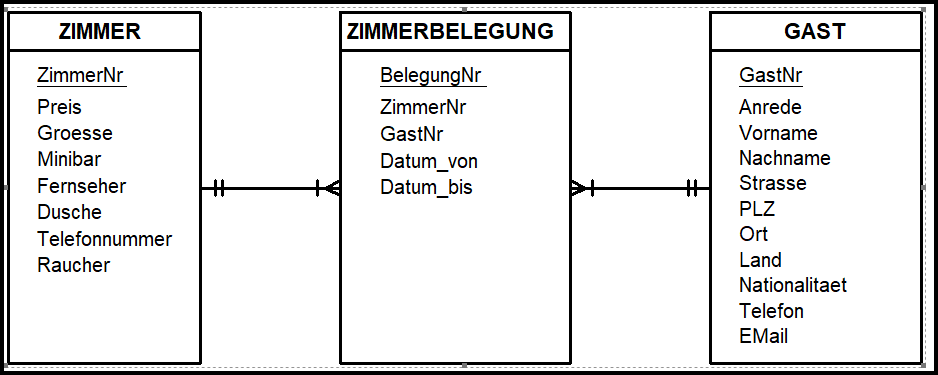

# Inhalte zum Tag 9

## Tätigkeiten
Heute habe ich die Theorie zu [Assoziationen](Theorie/Assoziationen.md) in Java bearbeitet. Diese Theorie habe ich aus dem Skript  von Herrn Inauen entnommen. Ich habe die Theorie in meinem eigenen Worten zusammengefasst. 

## Theorie

- [Assoziationen](Theorie/Assoziationen.md)

## Praxisaufgabe

Als Praxiaufgabe habe ich die Fragen im Skript beantwortet. Diese Fragen habe ich ebenfalls in der Seite [Assoziationen](Theorie/Assoziationen.md) beantwortet.

