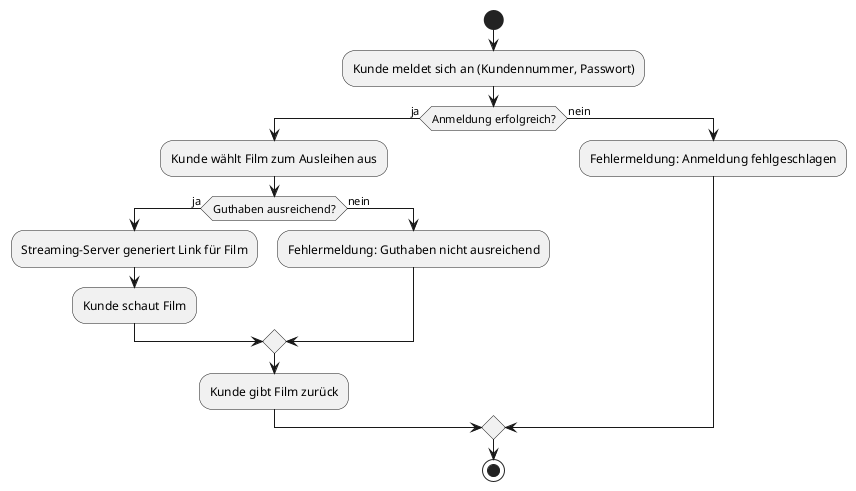

# JAVA Theorie

## Aktivitätsdiagramm

```plantuml
@startuml
|Kunde|
start
:Kunde meldet sich an (Kundennummer, Passwort);
if (Anmeldung erfolgreich?) then (ja)
:Kunde wählt Film zum Ausleihen aus;
if (Guthaben ausreichend?) then (ja)
:Streaming-Server generiert Link für Film;
:Kunde schaut Film;
else (nein)
:Fehlermeldung: Guthaben nicht ausreichend;
endif
:Kunde gibt Film zurück;
else (nein)
:Fehlermeldung: Anmeldung fehlgeschlagen;
endif
|Kunde|
stop
@enduml
```
