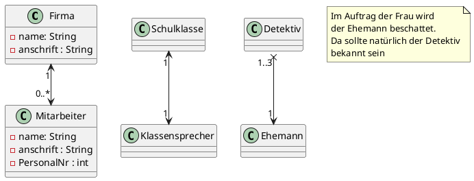
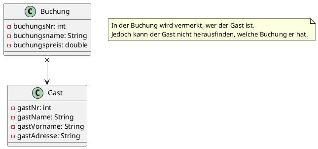
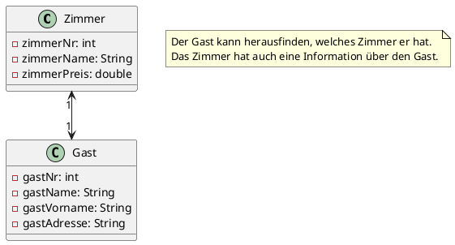
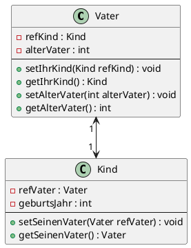
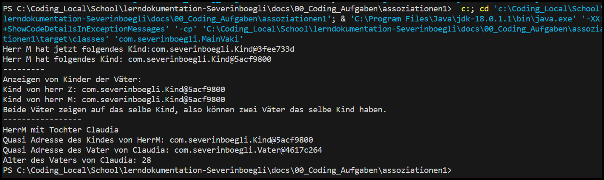

# JAVA Theorie

## Assoziationen (Beziehung)

Assoziationen sind Beziehungen zwischen zwei Klassen. Diese Beziehung kann einseitig oder beidseitig sein. Es gibt 1 zu 1, 1 zu n und n zu n Beziehungen. Entsteht eine n zu n Beziehung muss eine weitere Klasse eingefügt werden, damit man diese gut ausprogrammieren kann. Dies mach vor allem Sinn weil man später die Daten in eine Datenbank speichern kann.

### Verschiedene Arten von Beziehungen

Man kann jedes Software-Projekt grundsätzlich mit den folgenden Fällen durchleuchten:
1. “IST EIN” -Beziehung => Vererbung (kommt im nächsten Semester)
2. “NUTZT EIN” - Beziehung => Assoziation
3. “HAT EIN” - Beziehung => Aggregation
4. “IST TEIL VON” -Beziehung => Komposition

## Assoziation

Eine Assoziation ist eine allgemeine Beziehung, die uni- oder bidriektional seinen kann.

> Assoziation bedeutet "Nutzen" oder "Verwenden"
> Ein Gast nutzt ein Zimmer

Ich nutzte nun gerne das Beispiel von Herrn Inauen. Diese Beispiel zeigt verschiedene Varianten von Assoziationen:



<details>
  <summary><b>Hier Klicken um den Code von PlantUML anzuzeigen.</b></summary>

```
@startuml

class Firma {
    - name: String 
    - anschrift : String 
}

class Mitarbeiter {
    - name: String 
    - anschrift : String 
    - PersonalNr : int
}

class Schulklasse {
}

class Klassensprecher {
}

class Detektiv {
}

class Ehemann {
}

Firma "1" <--> "0..*" Mitarbeiter 

Schulklasse "1" <--> "1" Klassensprecher 

Detektiv "1..3" x--> "1" Ehemann 
note as N1
  Im Auftrag der Frau wird
  der Ehemann beschattet.
  Da sollte natürlich der Detektiv
  bekannt sein
end note

@enduml
```

</details>


### Navigierbarkeit

Es gibt verschiedene Arten von Navigierbarkeiten. Zum einen gibt es die **unidirektionale Beziehung** und zum anderen die **bidirektionale Beziehung**. Eine unidirektionale Beziehung ist eine Beziehung die nur in eine Richtung geht. Eine bidirektionale Beziehung ist eine Beziehung die in beide Richtungen geht.

**Beispiel unidirektionale Beziehung:**



<details>
  <summary><b>Hier Klicken um den Code von PlantUML anzuzeigen.</b></summary>

```

@startuml

class Buchung {
    - buchungsNr: int
    - buchungsName: String
    - buchungsPreis: double
}

class Gast {
    - gastNr: int
    - gastName: String
    - gastVorname: String
    - gastAdresse: String
}

Buchung  x-->  Gast
 note as Note
  In der Buchung wird vermerkt, wer der Gast ist.
  Jedoch kann der Gast nicht herausfinden, welche Buchung er hat.
 end note

@enduml

```

</details>


**Beispiel Bidirektionale Beziehung:**



<details>
  <summary><b>Hier Klicken um den Code von PlantUML anzuzeigen.</b></summary>

```

@startuml

class Zimmer {
    - zimmerNr: int
    - zimmerName: String
    - zimmerPreis: double
}

class Gast {
    - gastNr: int
    - gastName: String
    - gastVorname: String
    - gastAdresse: String
}

Zimmer "1" <--> "1"  Gast
 note as Note
  Der Gast kann herausfinden, welches Zimmer er hat.
  Das Zimmer hat auch eine Information über den Gast.
 end note

@enduml

```

</details>
<br><br>


<div class="question-box">
    Was geschieht, wenn man zwei Vätern das gleiche Kind zuweist? Warum?Geht es?
</div><br>

Man kann zwei Väter einem Kind zuweisen, da die Vater und Kind Klasse nicht direkt voneinander abhängig ist. Diese Klassen können zwar miteinander hinterlegt werden, jedoch können wie immer bei [Referenzen](Theorie/Referenzen_Vergleich?id=referenzen) mehrere Elemente auf ein Element verlinken.

### Praxisaufgabe vom Skript**

<details>
  <summary><b>Vater.java Klasse anzeigen.</b></summary>

```java

package com.severinboegli;

public class Vater
{
    /**
    * refKindist eine Referenzvariable vom Typ Kind.
    * Sie muss auf etwas zeigen, hier eben auf null
    */
    private Kind refKind = null;
    // Eine normale Wertvariable
    private int alterVater = 18;
    /**
    * refKind wird auf das Kind gesetzt
    * also auf das Kind, welches zum Vater gehört!*/

    public void setIhrKind(Kind refKind)
    {
        this.refKind = refKind;
    }

    public Kind getIhrKind()
    {
        return refKind;
        /* Hinweis: Man erhält eine etwas komische Ausgabe, 
        * den von einer oberen Klasse abgeleiteten Hashwert.
        * Wir sagen dem hier einfach anschaulich Adresse*/
    }

    public void setAlterVater(int alterVater)
    {
        this.alterVater = alterVater;
    }
    public int getAlterVater()
    {
        return alterVater;
    }
}


```

</details>

<br>


<details>
  <summary><b>Kind.java Klasse anzeigen.</b></summary>

```java

package com.severinboegli;

public class Kind
{
    /**
    * DasKind hat noch keine Kenntnis von dem Vater,
    * zeigt auf null
    */
    private Vater refVater = null;
    // Normale Wertvariable
    private int geburtsJahr= 0;
    /**
    * Es findet eine Parameterübergabe statt.
    * Die Klasse Kind macht einen Verweis zum Vater.
    * Das Kind kennt nun seinen Vater.
    */
    public void setSeinenVater(Vater refVater)
    {
        this.refVater = refVater;
    }
    public Vater getSeinenVater()
    {
        return refVater;
    }
}

```

</details>

<br>

<details>
  <summary><b>MainVaki.java Klasse anzeigen.</b></summary>

```java

package com.severinboegli;

public class MainVaki
{
    public static void main(String[] args)
    {
        // Es werden konkrete Objekte (Instanzen) erzeugt
        Vater herrM = new Vater();
        Vater herrZ = new Vater();
        Vater herrJ = new Vater();
        Kind claudia = new Kind();
        Kind hans = new Kind();
        Kind peter = new Kind();
        

        // Setzen des Alters der Instanz herrM
        herrM.setAlterVater(28);

        // herrM bekommt Claudia zeigt auf Instanz Claudia
        herrM.setIhrKind(claudia);
        System.out.println("Herr M hat jetzt folgendes Kind:" + herrM.getIhrKind());
        herrM.setIhrKind(peter);
        // Nun wurde das Kind geändert, es kann nur ein Kind des Mutter hinterlegt werden.
        System.out.println("Herr M hat folgendes Kind: " + herrM.getIhrKind());
        System.out.println("---------");

        herrZ.setIhrKind(peter);
        // Man kann zwei Väter einem Kind zuweisen, da diese einfach in eine Richtung auf das Kind verlinken.
        System.out.println("Anzeigen von Kinder der Väter:");
        System.out.println("Kind von herr Z: " + herrZ.getIhrKind());
        System.out.println("Kind von herr M: " + herrM.getIhrKind());
        System.out.println("Beide Väter zeigen auf das selbe Kind, also können zwei Väter das selbe Kind haben.");

        System.out.println("-----------------");
        claudia.setSeinenVater(herrM);
        System.out.println("HerrM mit Tochter Claudia");
        System.out.println("Quasi Adresse des Kindes von HerrM: " + herrM.getIhrKind());

        System.out.println("Quasi Adresse des Vater von Claudia: " + claudia.getSeinenVater());

        System.out.println("Alter des Vaters von Claudia: " + herrM.getAlterVater());

    }
}

```

</details>




<details>
  <summary><b>Hier Klicken um den Code von PlantUML anzuzeigen.</b></summary>

  ```

@startuml


    class Vater {
        - refKind : Kind
        - alterVater : int
        ---
        + setIhrKind(Kind refKind) : void
        + getIhrKind() : Kind
        + setAlterVater(int alterVater) : void
        + getAlterVater() : int
    }

    class Kind {
        - refVater : Vater
        - geburtsJahr : int
        ---
        + setSeinenVater(Vater refVater) : void
        + getSeinenVater() : Vater
    }

    Vater "1 " <--> "1 " Kind

@enduml
```

</details>


### Konsolenausgabe



## Aggregation

Eine Aggregation ist eine spezielle Form von einer Beziehung. Zwei Objekte haben eine Beziehung zueinander, jedoch können die Objekte auch ohne Beziehung zueinander existieren.

> Aggregation bedeutet "Zusammenfassung" oder "Gesamtheit"
> Bei Aggregation spricht man von *HAT EIN*

Bei einer Aggregation gehört also immer ein Teil zu etwas Ganzem dazu. Zum Beispiel hat eine Bücherei ein Buch. Das Buch kann aber auch ohne die Bücherei existieren. Die Bücherei kann auch ohne das Buch existieren. Es ist also eine lose Beziehung.

```plantuml

class Buch {
    - titel : String
    - erscheinungsjahr: int

    + setTitel(String titel) : void
    + getTitel() : String
}

class Buechereich {
    - name : String
    - ort : String
    - baujahr : int

    + setName(String name) : void
    + getName() : String
}

Buch "0--*" --o "1" Buechereich

class Messer {
    - material : String
    - messerID : double
}

class Gabel {
    - material : String
    - gabelID : int
}

class Besteck {
    - besteckID : int
}

Messer "0--*" --o "1" Besteck
Gabel "0--*" --o "1" Besteck
```

<details>
  <summary><b>Hier Klicken um den Code von PlantUML anzuzeigen.</b></summary>

  ```

class Buch {
    - titel : String
    - erscheinungsjahr: int

    + setTitel(String titel) : void
    + getTitel() : String
}

class Buechereich {
    - name : String
    - ort : String
    - baujahr : int

    + setName(String name) : void
    + getName() : String
}

Buch "0--*" --o "1" Buechereich

class Messer {
    - material : String
    - messerID : double
}

class Gabel {
    - material : String
    - gabelID : int
}

class Besteck {
    - besteckID : int
}

Messer "0--*" --o "1" Besteck
Gabel "0--*" --o "1" Besteck
```

</details>


*Dies sind zwei Beispiele wie eine Aggregation angewendet werden kann.*


## Komposition
eine spezielle Assoziation, strenger als Assoziation - Teile/Ganzes Hierarchie, wobei Teile existenziell vom Ganzen abhängig sind

