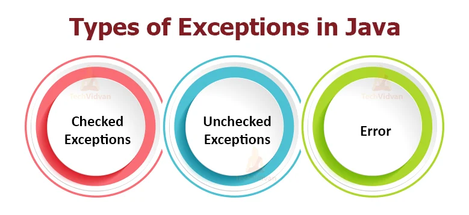

# Exceptions




## Unterschied Exception und Error
Eine Exception ist im Unterschied zu einem Error ein Fehler, der abgefangen werden kann und mit dem das Program weiterlaufen kann. Tritt ein Error auf, so kann das Programm meistens nicht weiterlaufen und wird beendet, da Java-Runtime-Environment (JRE) nicht mehr funktioniert.

Nun ist es wichtig, das man die verschiedenen Exception unterschiedlich abfangen kann, damit man dem User eine möglichst genaue Fehlermeldung geben kann.

## Exception abfangen
Mit try & catch kann man die Exception abfangen und eine Fehlermeldung ausgeben. Dies kann folgendermassen aussehen:

```java
public static void main(String[] args)
{
    String s = "ABC";
    try // versucht etwas auszuführen.
    {
        int i = Integer.parseInt(s);
        System.out.println("Die Zahl ist " + i);
    }
    catch (NumberFormatException e){ // Falls ein Fehler auftritt, wird dieser abgefangen. Hier werden explizit nur Fehler bei der Numerumwandlung abgefangen.
        System.out.println("Die Zahl konnte nicht umgewandelt werden.");
    }
    catch (Exception e) {
        System.out.println("Ein Fehler ist aufgetreten."); 
        // Hier werden alle weiteren Fehler abgefanden, die kein NumberFormatException sind.
    }

    finally {
        // Dieser Block wird immer ausgeführt, egal ob ein Fehler aufgetreten ist oder nicht. Er wird auch ausgeführt, wenn ein break oder return im try oder catch Block vorkommt.
    }
}
```

Mit dem Try & Catch kann man sogar bewirken, dass ein Fehler abgefangen wird und das Program normal weiterläuft. Es sollte jedoch nie einfach ein Fehler abgefangen werden, sondern immer eine Fehlermeldung ausgegeben werden. Try & Catch ist auch sehr sinnvoll für die Fehlersuche im Späteren Verlauf eines Projektes.