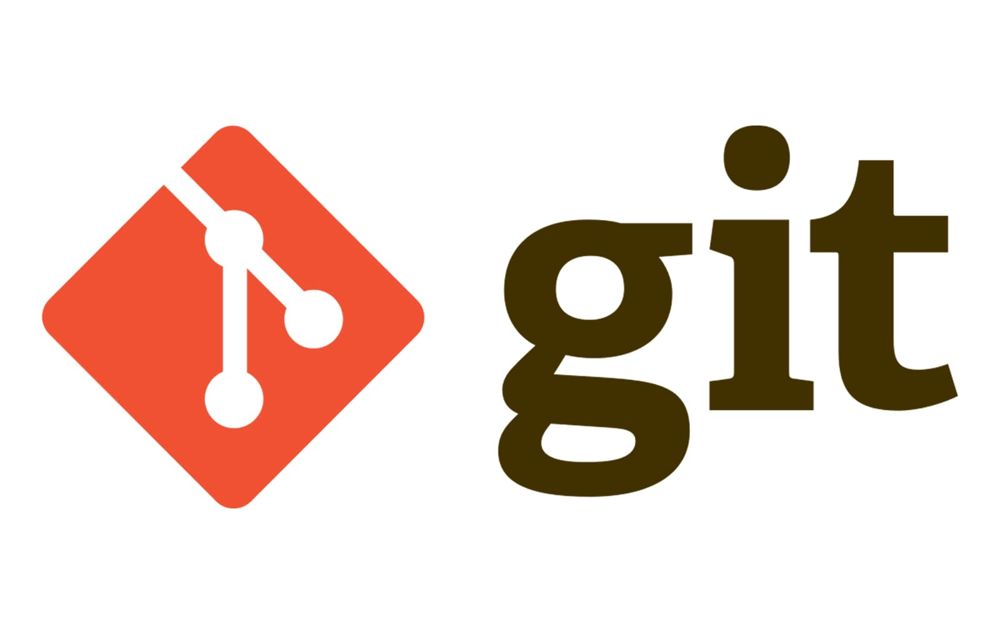

# Git Theorie {docsify-ignore-all}

In diesem Abschnitt wird alles rund um Java beschrieben. Es werden wichtige Java Funktionen und Basics dokumentiert.

## Was ist GIT?
Git ist ein Service, der es einem User ermöglicht die Versionen des Sourcecodes zu verwalten. Ein Vorteil von Git ist, dass man sehr gut mit anderen zusammenarbeiten kann. Github Desktop eine grafische Oberfläche, die mit git im Hintergrund ebenfalls eine Versionsverwaltung ermöglicht.

## Wie funktioniert GIT?
Das Prinzip von Git ist, dass eine lokale Version des Projekts auf dem Gerät gespeichert wird. Bei einer Änderung wird dies erkennt und kann über ein Commit gespeichert und über ein Push hochgeladen werden.

**Merkliste:**
- Commits: Ist eine Version des Codes, wird also ein Commit erstellt, stellt dieser Commit den akutellen Stand und die Abänderungen dar.
- Branches: Ein ist wie ein Ast von einem Bau. Es gibt ein Hauptast, der das Eigentliche Projekt beinhaltet, jedoch wird ein unterbranch erstellt, wenn Experimente oder Code erstellt wird, der die Ausführung des Main Branches beschädigt.
- Merge: Bei einem Merge werden arbeiten unterschiedlicher Personen oder Branches zusammengeführt. Programmiert Person A etwas und Person B am gleichen Projekt am gleichen Branch, haben beide eine andere Version. Damit beide Arbeiten gesichert werden, wird ein Merge durchgeführt und der doch wird zusammengeführt.
- Pull: Pull aktualisiert die lokalen Dateien mit dem Repo auf Github.
- Push: Lädt die Änderungen (Commits) hoch in das Repo, z.b. auf Github.

**Wichtige Befehle:**
- git push
- git pull
- git init
- git commit -m "Die Nachricht für den Commit"
- git status
- git log

