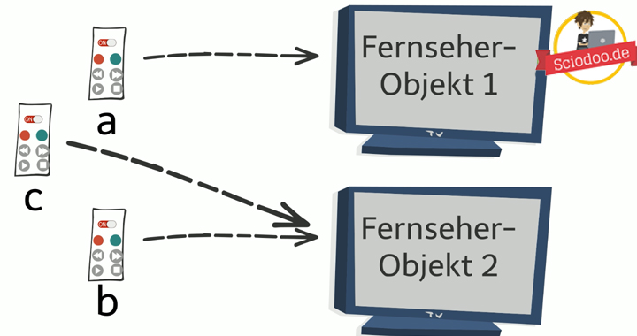

# JAVA Theorie

In diesem Abschnitt wird alles rund um Java beschrieben. Es werden wichtige Java Funktionen und Basics dokumentiert. Um Codebeispiele besser darzustellen wrid mit Codesnippes gearbeitet:


## Referenzen

Eine Referenz ist ein Pointer, der auf ein bestimmtes Objekt zeigt. Wird ein Objekt erstellt, wird eine Referenz erstellt, die auf das Object zeigt.
Weisst man nun dem gleichen Objekt ein andere Variabel zu sind dies voneinander abhängig.
```java
Circle b = new Circle();
Circle c = b;
```
> Hier zeigt der Kreis c auf b, was also das gleiche Element ist.



> ändert man den Wert von b, wird sich auch der Wert von c ändern.

## Vergleichen

- Mit dem `==` Operator wird vergleichen ob beide Werte (b & c) auf das gleiche Objekt (Referenz) zeigen.
- Mit der `.equals()` Methode wird geschaut ob der Inhalt der selbe ist, also ob beide Objekte den Parameter "length" auf 10 haben.