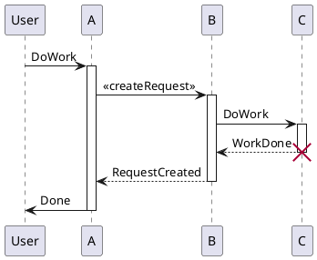

# JAVA Theorie

## Sequenzdiagramm

Ein Sequenzdiagramm ist ein UML-Diagramm, das die Verbindungen zwischen verschiedenen Klassen darstellt. Dabei wird die Reihenfolge der Aufrufe dargestellt. Das Ziel von einem Sequenzdiagramm ist es, dass man den Ablauf des Programms versteht.

**Computerbauteile Sequenzdiagramm**

```plantuml
participant "Main" as Main

create "DiskA:Disk" as DiskA
Main --> DiskA : new

create "DiskB:Disk" as DiskB
Main --> DiskB : new

create "ComputerA" as ComputerA
Main --> ComputerA : new(DiskA)

activate ComputerA #005500
activate DiskA #lightgreen

group Disk wechseln
ComputerA --> DiskA : Disk ausbauen
deactivate DiskA
activate DiskB #lightgreen
ComputerA <-- DiskB : Disk einbauen
end
```

<details>
  <summary><b>Hier Klicken um den Code von PlantUML anzuzeigen.</b></summary>

  ```
  participant "Main" as Main

create "DiskA:Disk" as DiskA
Main --> DiskA : new

create "DiskB:Disk" as DiskB
Main --> DiskB : new

create "ComputerA" as ComputerA
Main --> ComputerA : new(DiskA)

activate ComputerA #005500
activate DiskA #lightgreen

group Disk wechseln
ComputerA --> DiskA : Disk ausbauen
deactivate DiskA
activate DiskB #lightgreen
ComputerA <-- DiskB : Disk einbauen
end
  ```

</details>

Dies ist ein Einfaches Beispiel wie man ein Sequenzdiagramm darstellen kann.

### Funktionen

**Begriffe**
- actor
- entity
- database
- collections
- participant
> **Hinweis:** Diese Begriffe werden benutzt um die verschiedenen Klassen darzustellen.

<br>

- alt / else --> wird benutzt für eine if else abfrage
- loop 1000 times --> wird benutzt für eine while schleife
- group und angezeigter Text --> wird benutzt um eine Gruppe zu erstellen
> **Hinweis:** Die Gruppe wird mit dem Schlüsselwort end beendet.

```plantuml
!theme aws-orange

alt erfolgreicher Fall
    actor actor1
    entity entity1
    actor1 -> entity1 : Nachricht senden
end

    
database database1
collections collections1
participant participant1

loop 100 times : Webseitenaufruf
    actor1 -> database1 : SQL Abfrage
    database1 -> participant1 : Daten senden

    alt request failed
        actor1 <-- participant1 : Fehlermeldung
    end
end
note right : Dies ist eine Notiz
```

<details>
  <summary><b>Hier Klicken um den Code von PlantUML anzuzeigen.</b></summary>

  ```

alt erfolgreicher Fall
    actor actor1
    entity entity1
    actor1 -> entity1 : Nachricht senden
end

    
database database1
collections collections1
participant participant1

loop 100 times : Webseitenaufruf
    actor1 -> database1 : SQL Abfrage
    database1 -> participant1 : Daten senden

    alt request failed
        actor1 <-- participant1 : Fehlermeldung
    end
end
note right : Dies ist eine Notiz

```

</details>

### Aktivieren / Deaktivieren

Eine weitere nützliche Funktion ist das Aktivieren und Deaktivieren von Klassen. Dies wird benutzt um zu zeigen, dass eine Klasse eine andere Klasse aufruft. Dies wird mit dem Schlüsselwort activate und deactivate gemacht.



<details>
  <summary><b>Hier Klicken um den Code von PlantUML anzuzeigen.</b></summary>

  ```
@startuml
participant User

User -> A: DoWork
activate A

A -> B: << createRequest >>
activate B

B -> C: DoWork
activate C
C --> B: WorkDone
destroy C

B --> A: RequestCreated
deactivate B

A -> User: Done
deactivate A
@enduml
```