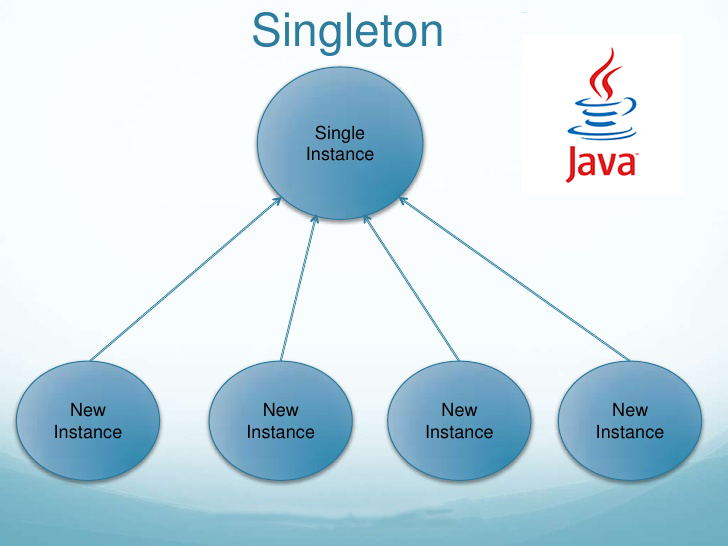

# JAVA Theorie {docsify-ignore-all}

## Singleton


Wenn man von einem Singleton Pattern spricht, wird festgelegt, dass nur ein Objekt von einer Klasse erstellt werden darf. Im Singleton wird überprüft, ob das Objekt bereits existiert, falls bereits ein Objekt exisitert, wird das bereits erstellte Objekt übergeben.

> Druckeraufträge, die nur über ein Spooner laufen sollen ist ein gutes Beispiel für ein Singleton.



### Einfache Anwendung

> Meiner Meinung nach die einfachste Anwendung für Singleton (Lazy Instantiation)

```java
class PrintService{
    private static PrintService obj;
    private PrintService(){} // Leerer Konstruktor

    public static PrintService getInstance() {
        if (obj == null) {
            obj = new PrintService(); // Nur beim ersten Mal wird ein PrintService Objekt erstellt.
        }
        return obj;
    }

    public void printedDocuments() {
        // Hier könnte nun ein Parameter erhöht werden.
    }
}
```

> Meiner Meinung weniger verständlicheres Beispiel aber dafür kürzer

```java
class PrintService{
    private static PrintService obj = new PrintService();
    private PrintService(){} // Leerer Konstruktor

    public void printedDocuments() {
        // Hier könnte nun ein Parameter erhöht werden.
    }
}
```