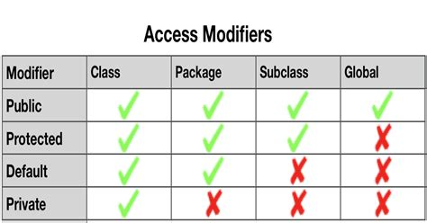

# JAVA Theorie {docsify-ignore-all}

In diesem Abschnitt wird alles rund um Java beschrieben. Es werden wichtige Java Funktionen und Basics dokumentiert.

## Zugriffsmodifizierer

Ein Zugriffsmodifizierer beschreibt, von wo eine Funktion oder ein Attribut erreichbar ist. Eine Person sollte nicht immer in der Lage sein eine Variabel zu verändern, was zur Folge haben kann, dass der Wert in der Variabel gar nicht möglich seien darf. Mit Zugriffsmodifizierern kann man definieren welche Funktionen und Variabel auch in anderen Klassen verfügbar sein soll oder nicht.

Es gibt vier verschiedene Arten von Zugriffsmodifizierern:
1. **Public**, alle Klassen ausserhalb der Klasse können darauf zugreifen.
2. **protected**, alle Pakete im Package und Unterklassen haben Zugriff
3. **(default)**, ist nur im selben Package und in der selben Klasse erreichbar, sollte normalerweise jedoch nicht verwendet werden.
4. **private**, die Funktion / Variabel kann nur von der Klasse aufgerufen werden. Dies macht Sinn, bei Werten die nicht ohne Überprüfung verändert werden sollten.



### Anwendung

> public wird meistens Funktionen zugewiesen, die etwas verändern oder abrufen

> private ist für Werte, die ausserhalb der Klasse nicht sichtbar seien sollten

Dies ist ein gutes Beispiel, wie die Zugriffsmodifizierer verwendet werden.
Eine Variabel wird private dekliniert, jedoch hat diese nun eine Getter- und Setter-Funktion, die den Wert von der Variabel veränder können und abrufen können.
Eine private Funktion kann dann zum Beispiel sein, ob eine Person Berechtigung hat etwas abzuändern. Dies muss jedoch nur intern in der Klasse abgefragt werden, weshalb es als privat gesetzt worden ist.
```java
public class Dreieck {
    private Point[] points;

    public Dreieck(Point a, Point b, Point c) {
        setPoints(new Point[]{a,b,c});
    }

    private boolean hasAccess(Access access) {
        return access.point;
    }

    public Point[] getPoints() {
        return points;
    }

    public void setPoints(Point[] points) {
        if (hasAccess(access)) {
            this.points = points;
        } else {
            System.out.println("kein Zugriff.");
        }
    }
}
```

## Static

Ein Spezialfall ist wenn es wenn eine Funktion oder ein Attribut statisch ist. Eine statische Funktion kann aufgerufen werden ohne, dass eine Instanz der Klasse erstellt werden muss. Meistens wird eine Variabel statisch, wenn der Attribut immer gleich ist. Ein gutes Beispiel von einer statische Variabel ist das PI von Math.

```java
double umfang = 2 * Math.PI;
```

